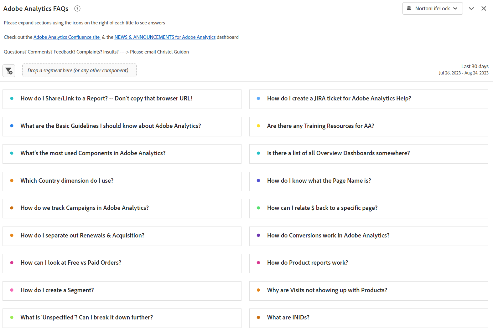
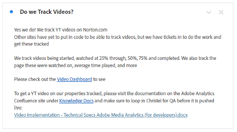
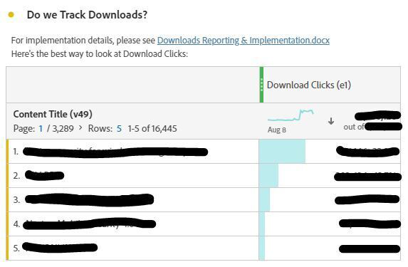
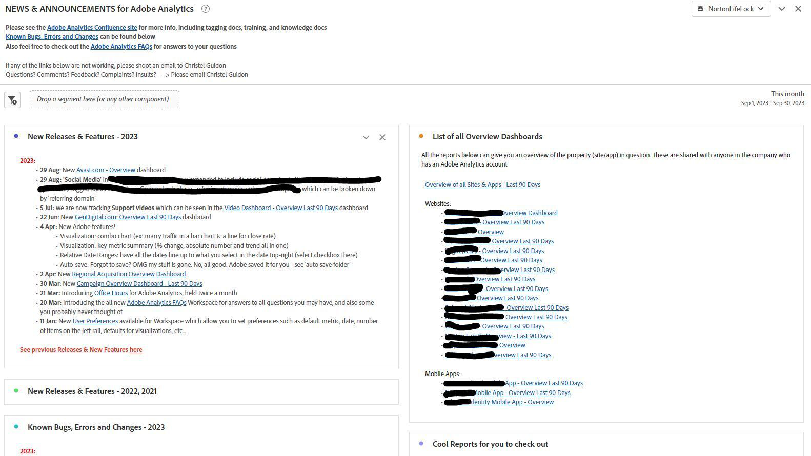

# Analysis Workspace で運用ダッシュボードを作成する

_Adobe Analytics Workspace の操作ダッシュボードが、通信と効率性に革新をもたらす仕組みについて説明します。 情報の合理化、ユーザーエクスペリエンスの向上、エンゲージメントの強化のための FAQ、ニュースとお知らせ、バグと機能のダッシュボードの作成方法を説明します。_

私は、多くの管理者と同様に、Adobe Analytics の内部情報ハブ（Confluence など）を運営しています。 時間の経過と共に、同じ質問に繰り返し回答することにうんざりし、常にユーザーに迷惑をかけていると感じさせずに、ユーザーに連絡するためのよりスムーズな方法を必要としていました。 静的でない情報を格納するリポジトリが必要でした。

ユーザーが「自分のVPNがオフになっている」、「今は読めない」などの理由で、Confluence サイトへの紹介を無視することがよくあることに気づきました。基本的に「後で読みます」というのは、読まれることはなく、同じ質問が来週も繰り返されます。

***実現するヒット：**Workspace の汎用性は、ゲームチェンジャーとなる可能性があります。 ユーザーは Workspace 内での迅速で直接的な回答を好むので、余分な手順を避けるために、Workspace 内で回答を保持しましょう。*

私は操作ダッシュボードを作成して、会社全体で共有することにしました。 これまでは、ユーザーに情報を提供し、情報を一元管理し、フラストレーションを軽減してきました。 これは、時間の経過と共に効率を向上させる、簡単で進化し続けるプロセスです。

私がいなくても多くの良い情報を得ることができ、サイトの領域を理解し、Adobe Analyticsがどれほどクールであるかを確認し、（私にとって重要な😊）質問を減らし、時間を短縮することができました。

**サイトのすべてのプロパティまたは主要領域に対してダッシュボードを作成することを強くお勧めします。** プロパティ/サイト/アプリ/フローの概要を説明し、基本的な情報と迅速なインサイトを得る必要があります。 すべてのユーザーがサポートを必要とせずに、プロパティを理解できるように、会社全体で共有する必要があります。 私の場合、これらのダッシュボードは通常、寄せられる質問の 80％に回答してくれるので、貴重な時間を節約できます。

これらによって、非常に便利な Confluence サイトを維持することが妨げられるわけではありません。 私は、各操作ダッシュボードの上部でも参照しています。 ただし、私はショートカットが大好きです。私にとってもユーザーにとっても便利だからです。

ここでは、私が勤務する会社 GenDigital 向けに作成し、これらの目標の達成に役立った 3 つの運用ダッシュボードについて説明します。

1. よくある質問（FAQ）
1. ニュースとお知らせ
1. バグ、機能、メジャーリリースのログ

## 1 - FAQ ダッシュボード

繰り返される回答の無限ループにうんざりしていませんか？ 停止！ 時間を節約するには、FAQ ダッシュボードを作成します。 ユーザーは質問する前にこのダッシュボードを参照できますし、あなたは返信の中で素早くそのダッシュボードへのリンクを共有できます。

質問をタイトルとして、回答／説明をコンテンツとして、すべて折りたたんで質問のみを表示する[テキストのビジュアライゼーション](https://experienceleague.adobe.com/docs/analytics/analyze/analysis-workspace/visualizations/text.html?lang=ja)を作成するだけです。 関連性（ページや製品など）ごとにグループ化するか、パネルを使用します。 シンプルにして、一般的なクエリを最優先にします。

長いメールを書いたり、古い説明を再発見したりする代わりに、FAQ ダッシュボードを更新します。 今すぐ開始し、時間の経過と共に展開します。 ハイパーリンクを使用して、レポート内の他のダッシュボードや関連する FAQ を参照します。 必要に応じて、他のダッシュボードから FAQ にリンクすることで、複雑なコンテキストを提供します。

Gen Digital の FAQ は、Adobe Analytics の基本的な使用方法ではなく、カスタマイズされた使用方法に焦点を当てています。 右クリックして「ビジュアライゼーションリンクを取得」を選択し、バニティ URL を共有して、特定の FAQ リンクをメールで送信します。 これで、ユーザー向けの正確なコンテンツがハイライト表示されます。 データのイラストにはフリーフォームテーブルを使用し、「説明を編集」でさらに説明を追加します。

FAQ が包括的であると感じたら、会社全体でアクセスして学習できるように共有します。 必要に応じて、機能強化を続けます。

FAQ ダッシュボードのスクリーンショットを以下に示します。

## 2 - ニュースとお知らせダッシュボード

もう 1 つの便利な運用ダッシュボードは、ニュースとお知らせダッシュボードです。 私は、ユーザーに情報を提供しようとこれを始めたのですが、逆にユーザーに迷惑をかけているように感じました。 すべてのユーザーがこのアップデートを必要としていますか？ 必要としているのはどのユーザーですか？ パワーユーザーのみですか？ 誰も読まないような週刊ニュースレターを本当に送るべきでしょうか？ 代わりに Workspace に直接アップデートを表示しておけば、ユーザーはログインしたときにすぐ内容を確認でき、誰も読みたがらないような社内メールをいちいち送らなくて済みます。

これらのダッシュボードは会社全体で見ることができるので、アップデートはすぐに上部に表示されます。 ニュースとお知らせダッシュボードに含める情報のタイプを以下に示します。

- 自社側の機能リリースや更新（主にコードリリース）
- アドビの重要な新機能
- 業務時間のスケジュール
- チェックアウトするすべての概要ダッシュボードと優れたレポートのリスト

新機能、トラッキング、重要なダッシュボードについて説明します。 テキストレポート（または、他のレポートで右クリックして「説明を編集」を選択した箇所）内のハイパーリンクを使用すると、Adobe Analytics の他のダッシュボードや Adobe の機能リリースページにリンクできます。

ニュースとお知らせダッシュボードを以下に示します。

## 3 - バグ、機能、メジャーリリースのログ

この操作ダッシュボードの目標は、すべてのバグとエラーを一元的に配置する場所を用意することです。 以前は Excel で管理していましたが、共有するのが面倒で大変でした。 Workspace に直接配置してみてはいかがでしょうか？

あまり目立たないようにする場合は、ニュースとお知らせダッシュボードに統合できます。 ただし、バグレポートが会社にとって重要または重大である場合は、別のダッシュボードを使用することが賢明かもしれません。

私はテキストのビジュアライゼーションを使用し、箇条書きで非常にシンプルにしています。 箇条書きには、バグの日付とプロパティを接頭辞として付けています（例：「3jan23-17jan23 - Norton.com」、「Prior to 14sep22 - Chat」）。 次に詳細を追加し、短く簡潔に保つようにしています。 どのチームに問題があるのかを明らかにすることは避け、ユーザーがおそらく気にしないであろう技術的な詳細を過度に追加することも避けます。

最新のバグが一番上に表示されますが、古いバグは年次テキストレポート（例：「2022年 - 既知の不具合、エラー、変更点」）に表示され、すべて折りたたまれています。

特別なものは何もありません。 これは本当に簡単で、ハードドライブに保存して Confluence で更新し続ける Excel ファイルよりもはるかに優れていることは認めざるを得ません。

また、ここでは、他の操作ダッシュボードと同様に、概要ダッシュボードと優れたレポートについても参照します。 FAQ ダッシュボードおよびニュースとお知らせダッシュボードへのリンクは上部にあります。

ログの例を次に示します。

Adobe Analytics Workspace で操作ダッシュボードを作成することは、自分にとってゲームチェンジャーでした。 多くの管理者と同様に、内部ハブを管理しつつ、回答の重複やユーザーとの効果的なコミュニケーションに苦労していました。 動的リポジトリの必要性により、Workspace の汎用性がエンゲージメントに革命をもたらす可能性があるという認識に至りました。 Adobe Analytics Workspace の操作ダッシュボードの機能をご活用いただければ幸いです。 ユーザーエクスペリエンスを向上させ、時間を節約し、より整理された環境を楽しみましょう。 今、ジャーニーが始まります。これらのダッシュボードは、効率性と使いやすさを実現する鍵となります。

## 作成者

このドキュメントの作成者：

**Christel Guidon**（Gen 社、デジタル分析プラットフォームマネージャー）

Adobe Analytics チャンピオン
