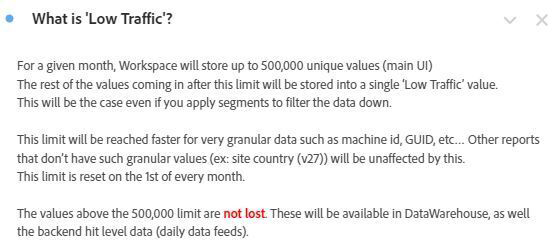

# Analysis Workspace内での操作用ダッシュボードの作成

_Adobe Analytics Workspace の運用ダッシュボードが、通信と効率性に革新をもたらす仕組みについて説明します。 情報の合理化、ユーザーエクスペリエンスの向上、エンゲージメントの強化のための FAQ、ニュースとお知らせ、バグと機能のダッシュボードの作成方法を説明します。_

多くの管理者と同様に、Adobe Analyticsの内部情報ハブ（Confluence など）を運営しています。 時がたつにつれ、同じ質問に繰り返し回答するのに飽き、私は、私がしびれているような気がせず、常に彼らを煩わせるような、よりスムーズにユーザーに到達する方法が必要でした。 静的ではない情報を保存するリポジトリが必要でした

「My VPN is off」や「I cannot read it now」などの理由で、多くの場合、ユーザーは Confluence サイトへのリファラルを無視していました。 基本的に、「後でその文書を読みます」とは、読み取られないという意味で、来週も同じ質問が再び求められます。

***適合ヒット：**ワークスペースの汎用性は、ゲームを大きく変えることができます。 ユーザーは Workspace 内ですばやく直接的な回答を好むので、余分な手順を避けるために、Workspace 内で回答を保持しましょう。*

私は会社全体を共有するための運用ダッシュボードを作成しました。 これまで、ユーザーに情報を提供し、情報を一元化し、不満を軽減してきました。 このプロセスは、時間の経過と共に効率を向上させる、容易で進化しています。

人々は、私なしで多くの良い情報を取得し、サイトの領域を理解し、Adobe Analyticsのクールさを参照し、( 私にとって重要??) 私に質問を減らし、私の時間を少なくすることができます。

**サイトのすべてのプロパティまたは主な領域に対してダッシュボードを作成することを強くお勧めします。** プロパティ、サイト、アプリ、フローの概要を示し、基本情報とクイックインサイトを持つ必要があります。 すべてのユーザーが手持ちでなくてもプロパティを理解できるように、会社全体と共有する必要があります。 私にとって、これらのダッシュボードは私が得る質問の 80%に答え、貴重な時間を節約します。

これらのどれもが、あなたの Confluence サイトを維持するのを妨げません。 各操作用ダッシュボードの上部でも参照します。 しかし、私は、私のためにも、私のユーザーのためにも、ショートカットが大好きです。

私の会社 GenDigital で作成した 3 つの運用ダッシュボードについて説明します。これらの目標に到達するのに役立ちました。

1. よくある質問（FAQ）
1. ニュースとお知らせ
1. バグ、機能、メジャーリリースのログ

## 1 - FAQ ダッシュボード*

繰り返し回答の無限ループに飽きたか？ Stop! FAQ ダッシュボードを作成して時間を節約します。 ユーザーが質問する前に問い合わせたり、回答ですばやくリンクしたりできます。

単に作成する [テキストのビジュアライゼーション](https://experienceleague.adobe.com/docs/analytics/analyze/analysis-workspace/visualizations/text.html) 質問はタイトル、回答、説明の形式でコンテンツとして表示され、すべて折りたたまれて、質問だけが表示されるようになりました。 関連度（ページや製品など）でグループ化するか、パネルを使用します。 一般的なクエリを優先して、シンプルにします。

長いメールを書いたり、古い説明を再発見したりする代わりに、FAQ ダッシュボードを更新してください。 今すぐ開始し、時間の経過と共に展開します。 ハイパーリンクを使用して、レポート内で他のダッシュボードや関連する FAQ を参照します。 必要に応じて、他のダッシュボードから FAQ にリンクすることで、複雑なコンテキストを提供します。

Gen Digital に関する FAQ では、基本ではなく、カスタマイズされたAdobe Analyticsの使用に焦点を当てています。 右クリック、「ビジュアライゼーションリンクを取得」を選択、バニティー URL を共有することで、特定の FAQ リンクを電子メールで送信します。 これで、ユーザー向けの正確なコンテンツが強調表示されます。 データの図にフリーフォームテーブルを使用し、「説明を編集」で説明を追加します。

FAQ が包括的だと感じたら、会社と共有して、共同でアクセスし、学習します。 必要に応じて強化を続けます。

FAQ ダッシュボードのスクリーンショットを以下に示します。

## 2 — ニュースとお知らせダッシュボード

もう 1 つの便利な運用ダッシュボードは、ニュースとお知らせのダッシュボードです。 私は、自分のユーザに情報を提供したいと思ったので、これを始めましたが、私は彼らを悩ませているように感じました。 誰もがこの更新を必要とするのか？ どのユーザー？ パワーユーザーのみ？ 誰も読まない週刊ニュースレターを送るべきですか？ 代わりに Workspace で直接更新を行うと、ユーザーはログイン後すぐに更新を表示できるので、誰も読みたくない別の会社の電子メールを送信する必要はありません。

これらのダッシュボードは全社的に見られるので、更新がすぐにトップに上がります。 ニュースとお知らせダッシュボードに含める情報の種類を次に示します。

- アドビ側の機能リリースと更新（主にコードリリース）
- Adobeの重要な新機能
- 営業時間スケジュール
- チェックアウトするすべての概要ダッシュボードとクールなレポートのリスト

アドビの新機能、トラッキング、および重要なダッシュボードについて説明します。 テキストレポート（または右クリック&amp;説明の編集で他のレポートの上にある）のハイパーリンクを使用すると、Adobe AnalyticsまたはAdobeの機能リリースページの他のダッシュボードにリンクできます。

ニュースとお知らせダッシュボードは次のように表示されます。

## 3 — バグ、機能、メジャーリリースのログ

このオペレーショナルダッシュボードの目的は、すべてのバグとエラーを一元的に配置することです。 以前は Excel で管理していましたが、共有するのは面倒で大変でした。 Workspace に直接配置しないのはなぜですか？

目立たないようにしたい場合は、ニュースとお知らせダッシュボードに統合できます。 ただし、バグレポートが重要または重要な企業の場合は、別のダッシュボードを使用する方が賢明です。

テキストのビジュアライゼーションを使用し、箇条書きで非常にシンプルにします。 箇条書きには、バグの日付とプロパティが先頭に追加されます（例： 「3jan23-17jan23 - Norton.com」、「Prover to 14sep22 - Chat」）。 その後、詳細を追加し、短く簡潔にするようにします。 私は、どのチームが故障していたかを示すのを避け、ユーザが気にしない可能性のある技術的な詳細を多く追加しすぎないようにします。

最新のバグは一番上に表示され、古いバグは年別のテキストレポート（「2022 — 既知のバグ、エラー、変更」など）に表示されます。すべて折りたたまれます。

何も想像しない。 ハードドライブ上で常に Confluence を更新し続ける Excel ファイルよりも、簡単に行うことができ、認める必要があります。

また、他の運用ダッシュボードと同様に、概要ダッシュボードとクールレポートもここで参照します。 FAQ やニュース&amp;お知らせのダッシュボードへのリンクが一番上にあります。

ログの例を次に示します。

Adobe Analytics Workspace での運用ダッシュボードの作成は、私にとって大きな変化でした。 多くの管理者と同じように、私は内部ハブを管理し、回答の重複と効果的なユーザーコミュニケーションに苦労しました。 動的リポジトリの必要性から、Workspace の汎用性がエンゲージメントに革新をもたらす可能性があるという認識が生まれました。 Adobe Analytics Workspace での運用ダッシュボードの力をご活用いただければ幸いです。 ユーザーエクスペリエンスを強化し、時間を節約し、より整理された環境を楽しみます。 今、ジャーニーが始まります。これらのダッシュボードは、効率性と使いやすさを実現する鍵となります。

## 作成者

このドキュメントの作成者：

**Christel Guidon**（Gen 社、デジタル分析プラットフォームマネージャー）

Adobe Analytics チャンピオン