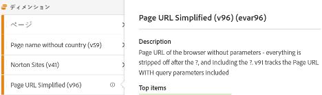
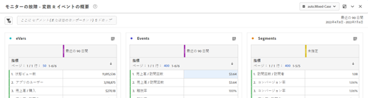

# Adobe Analytics実装プレイブックのダウンロード

使用を開始する前に、 [プレイブックをダウンロードする](assets/aa-implementation-playbook.xlsx).

## 「ビジネス要件」タブ

**対象：** ビジネス要件ドキュメント（一般に BRD と呼ばれます）は、主要な関係者、ビジネスユーザー、技術ユーザーが共同作業を行う際に非常に重要なドキュメントです。 ここでは、必要な KPI、レポート要件、およびAdobe Analytics(AA) の実装が完了した時点を確認する必要があるデータポイントをすべて文書化します。

**理由：** これは、以下のドキュメント（SDR、tech 仕様など）の出発点として、 そして、AA の最終状態に関して合意された人々に共通の真実の源です。 このドキュメントでは、組織内のチーム間で考えを整理し、実装を構築または強化することに向けて、一つのガイドの方向を形成します。

**方法：** ビジネス要件の文書化は AA のエンドビジネスユーザーが行うのが一般的ですが、技術的な課題が存在し、特定のデータポイントは他のデータポイントよりも多くの労力が必要となる場合があるので、テクニカルユーザーからフィードバックを得ることが重要です。

「サイトで追跡したいものは何ですか」、「レポートでの使用にとって重要なデータポイントは何か」、「これらのデータポイントが意思決定にどのように役立つか」と、最も重要な点は「意思決定にどのように影響するか」です。 各ビジネス要件を、ビジネス上の意思決定を伝えるために使用できるデータポイントに確実に関連付けることが重要です。 例えば、サイトのクリックごとに追跡したい場合がありますが、その日の終わりに、そのレポートから得られるインサイトは何ですか？

まず、下のスクリーンショットの列 C に入力します（ビジネス要件）。 これは、「当社のサイトで完了した内部検索の数」や「インプレッション数の点で最も効果的な内部キャンペーンのスポット」などにする必要があります。 このレベルの詳細を入力したら、列 B（カテゴリ）に戻って入力し、要件を「検索」や「内部プロモ」などのカテゴリにグループ化できます。これは、技術仕様のセクションに適しているはずです。

また、eVar、イベント、prop または組み合わせを使用して、追跡したいものを実現するかどうかも指定します。

最後に、「実装ステータス」列は、サイトに何かを追加し始める際のステータスチェックとして機能します。

## 「変数マップ」タブ（タグ付けドキュメント/SDR）

**対象：** タグ付けドキュメント（一般に SDR と呼ばれます）は、AA の技術ユーザーとビジネスユーザーの両方にとって重要なドキュメントです。 レポートスイートで使用されているすべての変数と、変数設定に関連するすべての詳細、変数の実装方法、レポートでの目的が一覧表示されます。 プロパティドキュメントと同様に、これは生き生きと管理された Excel ドキュメントで、タグ付けの強化や実装の変更が導入された際に、そのドキュメントを最新の状態に保つ責任を持つ人物である必要があります。

**理由：** このドキュメントは多くの目的に使用されますが、最も重要なのは次のとおりです。

* 導入を初めておこなうユーザー（新規採用者、使用可能なレポートの理解を深めたいビジネスオーナーなど）に対して、 このドキュメントでは、実装されているすべての変数の最適なビューと、AA の設定を学習する際に個人が自己提供できるようにするための目的を示します。
* AA 製品の所有者または技術ユーザーの場合、このドキュメントは、他の変数の設定方法と、新しいディメンションを追加する際に使用できる変数を示すリマインダーとして機能します。

**方法：** 最初に、すべてのAdobe変数（ページ、製品、地域など）と、Excel ドキュメント内の eVar、prop、イベント、リスト変数を一覧表示します。 サイト/レポートスイートごとに 1 つのタブが必要です。
これらの各ディメンションに対して、次の列を追加します。
* **名前：** ほとんどの場合に理解できる簡単で短い名前を指定します。 これは、新しいユーザーがデータセットを取得し、変数が取得する意図を理解できるように、十分に直感的である必要があります。
* **説明：** 変数が何に使用され、どのデータを追跡するかに関する詳細。 これは簡単で短く、インターフェイスで使用される説明と一致させます。 ユーザーがタグ付けドキュメントを参照する必要がなくなるのが理想です。 したがって、新しいディメンションが管理バックエンドで設定された場合、同じ説明をそこに追加します。 これにより、ユーザーは Workspace で直接情報アイコンを押して、ディメンションが何かを把握でき、Excel ドキュメントを取り出す必要がなくなります。

* **コード：** 値を設定するバックエンドのコード。 これは、ページ上のデータレイヤーのフィールドにすることも、Launch ルールや処理ルールなどを使用して実行することを呼び出すこともできます。
* **分類レポート：** 分類インポーターまたは分類ルールビルダーを使用しておこなわれる分類レポートを呼び出します。
* **ソリューションの範囲：** すべてのプロパティ（少なくとも標準以上の変数を使用するプロパティ）を小さな列にリストし、そのプロパティで設定される各ディメンションにチェックマークを追加すると便利です。 これにより、特定のプロパティを簡単にフィルタリングでき、特定のディメンションが設定されている場所をすばやく確認できます。
* **設定：** 各変数の管理 UI 設定（eVar の場合は、有効期限、配分、マーチャンダイジングなど）

サンプル SDR のスクリーンショット：

また、このタグ付けドキュメントを使用して、空き変数と「無効な」変数を追跡することをお勧めします。 ディメンションが役に立たなくなった場合、開発では通常、ディメンションを削除するのに時間がかかります。 その後も、キャッシュが発生する場合や、ディメンションが別の場所でも設定されていることに気付く場合があります。 ディメンションのクリーンアップは容易ではなく、多くの場合、忍耐が必要です。 ここでは、ユーザーが迷惑を避けながら、追跡を続けるために、あなたの迷惑メールをベッドの下に隠しておくためのヒントを紹介します。

* 使用されていないディメンション/イベントはすべて「無料」または「削除中」です
   * 過去 90 日間にディメンションに無効な値が含まれている場合は、「削除中」です
   * ディメンションが無料で、少なくとも過去 90 日間は明確である場合、「無料」です
   * タグ付けドキュメントの「名前」の下に含めるようにマークして、簡単にフィルタリングできるようにします。 タグ付けドキュメント（Excel データフィルター）でこれらのチェックをオフにしておき、ユーザーに表示されないようにします
   * ユーザーが検索でeVarを見つけられないように、これらをインターフェイスでデータ名としてマークします ( つまり、&#39;(v6)&#39;) をクリックし、インターフェイスの説明を削除します。
* これにより、新しいディメンションが必要な場合に、「名前」列で「無料」を簡単にフィルタリングして、使用するクリーンなディメンションを見つけることができます
* 「削除中」のディメンションとイベントについては、Workspace を使用してこれらを追跡することをお勧めします。
   * 次の 3 つのテーブルを持つ管理者に表示可能なプロジェクトを作成します。eVar、prop およびイベント。 特定の eVar には「インスタンス」を使用し、prop には「prop5 が存在する」を使用して HIT セグメントを作成します。
   * 日付を過去 90 日間に設定
   * 上記を 3 つのテーブルの行として使用し、一致する項目も含めます
   * 何かが&#39;0&#39;になるとすぐに、タグ付けドキュメントで&#39;無料&#39;とマークし、Workspace プロジェクトから削除します

このようにして、データは常にクリーンであり、迷惑メールに関する明確な考えを持っています。

## 「プロパティ」タブ

**対象：** プロパティドキュメントでは、すべてのデジタルプロパティ (Web サイト、モバイルアプリ、その他のツール（チャット、フィードバックなど）が、Adobe Analyticsでタグ付けされているかどうかに関わらず ) の一覧に表示されます。 これは、ビジネスユーザーとテクニカルユーザーをまたいで、一元化された生きたドキュメントとして機能します。

**理由：** これにより、すべてのデジタルプロパティにわたるユーザーのジャーニーと、Adobe Analyticsの機能および機能が明確に表示されるので、見つからないプロパティにタグ付けを追加することを優先順位付けできます。 この方法でデジタルエコシステムをレイアウトすることで、タグ付け戦略で潜在的な機会を特定して、ユーザーのジャーニーを完全に把握できます。 例えば、複数のドメイン/サイトをまたいで追跡するには、グローバルレポートスイートが必要ですか。 ドメイン間またはアプリからハイブリッドエクスペリエンスへの訪問者 ID の引き渡しは必要ですか？ クロスドメイントラッキングの場合、内部 URL フィルターを更新する必要がありますか？

**方法：** ガバナンスを提供するドキュメントの所有者と、更新を管理する単一の責任ソースを特定します。
「プロパティ」タブで、次のリストを表示します。
* **プロパティ名：** ドメイン、サブドメイン、アプリ名などが該当します。 同じドメイン内でも、その一部が別々に（別のチームや別のテクノロジーによって）管理されている場合は、それらを分離する必要があります。
* **リンク (URL)** 使用可能なプロパティ
* **所有者と連絡先：** プロパティのメイン所有者または連絡先のリスト
* **タグメソッド：** 多くのユーザーには、異なるコードメソッドと実装（Launch、JS ファイル、AEP など）が用意されています。 （コードバージョンやタグ管理システムなど）必要に応じて、これをさらに分類できますが、これは、コードの更新が必要な様々なコードメソッドやバージョン、およびその維持方法を追跡するために使用されます。 Launch を使用している場合は、Adobeのプロパティ名を一覧表示します。

Adobe Analyticsでタグ付けされていない場合でも、すべてのデジタルプロパティを必ず含めてください。 これにより、デジタル状況や、ユーザーがすべてのプロパティとどのようにやり取りするかを理解するのに役立ちます。

このドキュメントは、できるだけ簡単にし、情報を多く含めすぎないようにし、組織の様々な部分で解釈しやすいようにすることをお勧めします。 Analytics チームは、他のチームよりもデジタル状況をよりよく理解しているので、このドキュメントは、他のチームや経営陣が詳細な概要を提供するために使用することが多くあります。

>[!TIP]
>
>Adobe Analyticsでサイト名/プロパティディメンションを作成します。 サイト名/アプリ名を識別する専用のディメンション ( 通常はeVar) をAdobe Analyticsに持つことで、セグメント化、トラブルシューティング、仮想レポートスイートの作成などをおこなうことができます。 メリットは、特に複数のサイトを 1 つの（グローバル）レポートスイートで組み合わせる場合には、無限にあります。 キーは、すべてのページ読み込み (s.t calls/trackState) とすべてのカスタムイベント (s.tl calls/trackAction) を含め、開発チームが常にプロパティディメンションにこの値を設定するようにしています。 処理ルールは、これらの値を適切かつ一貫して設定するのに役立つツールとなります。

[Doug Moore のこのビデオをご覧ください](https://experienceleague.adobe.com/docs/analytics-learn/tutorials/implementation/implementation-basics/creating-a-business-requirements-document.html){target=&quot;_blank&quot;} を参照してください。

## 発言者

このドキュメントは次のユーザーによって共同で作成されました：

NortonLifeLock Adobe Analyticsチャンピオンの Digital Analytics Platform Manager、Christel Guidon 氏

レイチェル・フェンウィック、Adobeのシニアコンサルタント
