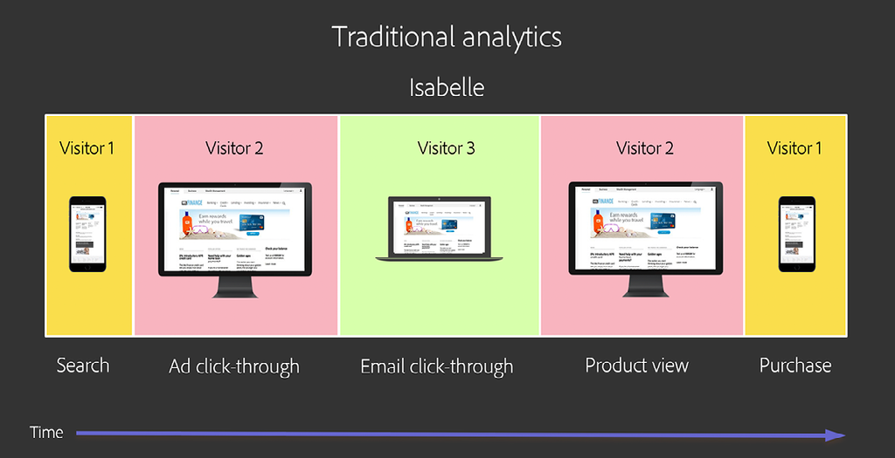
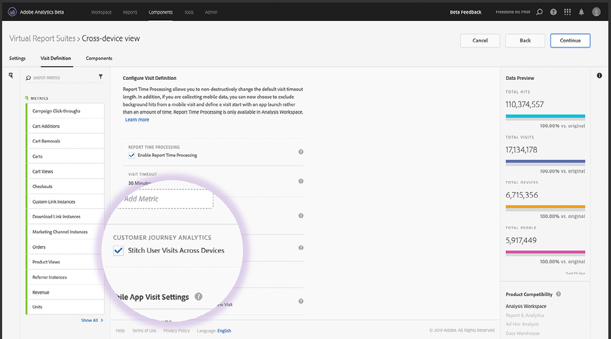

# [!DNL Journey IQ]の理解と使用 — クロスデバイス分析

ユーザーがブランドとやり取りする際、様々な方法や複数のデバイスでやり取りします。 クロスデバイス分析は、[!DNL Adobe Experience Platform Identity Service]と統合され、デバイスと人とのマッピング方法を特定します。 その後、このインテリジェンスを活用して、ユーザー行動のクロスデバイス表示を作成します。 これにより、デバイスではなく、人に関する分析が可能になります。

## クロスデバイス分析の概要

### 自分のデバイスではない

ユーザーがブランドとやり取りする際には、様々な方法で、複数の「サーフェス」または「デバイス」でやり取りします。 PCやモバイルデバイスでWebブラウザーを使用したり、モバイルアプリを使用したりします。 従来のデジタル分析は、cookieに基づくデータ収集で育ち、それぞれのサーフェスが一意の「訪問者」として表されます。 つまり、各人ユーザーは複数の個別訪問者として表されます。

次に例を示します Isabelleが次の方法でブランドとやり取りしたとします。

*イザベルは3人の訪問者*

従来の分析を使用して、イザベルの旅は3つの部分に分割されます。 Sarahは3人の個別訪問者として表され、それぞれが異なるデバイスを使用して個別のタスクを実行します。 必要なのは、イザベルの相互作用の、統一されたクロスデバイスビューです。 [!DNL Journey IQ: Cross-Device Analytics] は、このビューを提供します。

*Isabelleは、1人のユーザ*

### クロスデバイス表示による分析の向上

イザベルの行動に対する人間中心のクロスデバイスの視野を持つことは、分析に大きな影響を与える可能性があります。 例えば、従来の訪問者ベースのアプローチでは、マーケティングチャネルの効果の全体像は得られません。 イザベルの旅をもう一度見てみましょう。どのチャネルが製品表示と購入のクレジットを受け取るかに焦点を当てています。 簡単にするために[!UICONTROL ラストタッチ]アトリビューションを使用しますが、イザベルの行動を別々の訪問者に分けると、同じ問題がアトリビューションモデルを使用して発生します。 訪問者ベースの従来の世界観を使用すると、誤解を招くような結果が得られます。

*従来のAnalyticsとクロスデバイス分析チャネルのアトリビ*

クロスデバイス表示では、Eメールチャネルが製品表示と購入の両方のクレジットを受け取ることに注意してください。これは、より正確にイザベルの実際のエクスペリエンスを表します。

詳しくは、以下をお読みください。

* [!DNL Cross-Device Analytics]の仕組み
* [!DNL Cross-Device Analytics]の前提条件
* クロスデバイスデータの解釈
* Analysis Workspaceでのクロスデバイスデータの分析

## [!DNL Cross-Device Analytics]の仕組み

[!DNL Journey IQ: Cross-Device Analytics (CDA)] はと統合し、または [!DNL Adobe Experience Platform Identity Service]を使用して [[!DNL Co-op Graph]](https://docs.adobe.com/content/help/ja-JP/device-co-op/using/home.html) デバ [!DNL Private Graph] イスとユーザーとのマッピング方法を識別します。その後、このインテリジェンスを活用して、ユーザー行動のクロスデバイス表示を作成します。 CDAには、企業がマルチデバイスの使用状況や、ブランドとのやり取りに関する複数のデバイスの顧客体験を把握するのに役立つ、比類のない機能とツールが含まれています。 Analysis Workspaceの下のレイヤーとして配置され、[!UICONTROL フォールアウト]、[!DNL Flow]、[!DNL Cohort]、[!DNL Segment IQ]、[!DNL Attribution IQ]などの強力なツールを使用して、ユーザーベースのオーディエンス分析とクロスデバイスのアトリビューション、セグメント化、ジャーニー分析を深く分析できます。

###   [!DNL Cross-Device Virtual Report Suite]

CDAは、特別な種類のクロスデバイス[[!UICONTROL 仮想レポートスイート]](https://docs.adobe.com/content/help/ja-JP/analytics/components/virtual-report-suites/vrs-about.html)を通じて提供されます。 これにより、組織にクロスデバイス分析を導入する際に、元のデバイスベースのレポートスイートを引き続き使用できます。 CDA VRSの設定は簡単です。

VRSビルダーの手順1で、AdobeがCDA対応として設定した[!UICONTROL レポートスイート]を選択します。

*CDA対応のベース（ソース）レポートスイートの選 [!UICONTROL 択仮想]*
![[!UICONTROL レポートスイー] トステップ1](assets/cda-vrs-step-one.png)

次に、[!UICONTROL レポート時間処理]をオンにし、[!UICONTROL デバイス間のステッチ]を有効にします。

*レポー [!UICONTROL ト時間処理と] デバイス間での [!UICONTROL 切り替えの有効化仮想レポー]*

VRSの設定を完了し、保存します。 CDA VRSは、Analysis Workspaceに表示され、その横に次のような特別なアイコンが表示されます。

*Analysis Workspace仮想レポートスイートの「CDA VRS」*
![[!UICONTROL を選択しま] す。手順3](assets/cda-vrs-step-three.png)

>[!TIP]
>
>CDA対応のベース[!UICONTROL レポートスイート]の上に、CDAの[!UICONTROL 仮想レポートスイート]を好きなだけ作成できます。

### 履歴の復元

ユーザーがログインし、 [!DNL Co-op Graph]または[!DNL Private Graph]がユーザーを識別してデバイスをマッピングするのに時間がかかる場合があります。 CDAは30日間のルックバック期間を利用し、以前に識別されなかった訪問者を過去30日間までの人物として再認識できます。

これはどう役に立ちますか？ 上記のディスカッションから、Isabelleのユーザーの遍歴を思い出してください。

![[!DNL Cross-Device Analytics] ジャーニー](assets/cda-isabelle-journey-cross-device-analytics.png)

イザベルは購入直前までログインせず、[!DNL Co-op Graph]や[!DNL Private Graph]は購入後のいつかまで、イザベルのデバイスをマッピングしなかった可能性があります。 しかし、CDAの30日間のルックバックにより、CDAは、必要なジャーニーのクロスデバイスビューを提供し、個人レベルでイザベルの過去の行動を再現できます。

>[!NOTE]
>
>履歴は再記述できるので、CDA対応の[!UICONTROL 仮想レポートスイート]では、時間の経過と共にデータが変化する可能性があります。 CDAベースの分析からインサイトを伝える際は、次の点に注意してください。

## [!UICONTROL クロスデバイス分析]の前提条件

CDAは[[!DNL Analytics Ultimate]](https://helpx.adobe.com/legal/product-descriptions/adobe-analytics.html)に含まれます。 2019年9月以降、以下に示す前提条件を満たす[!DNL Analytics Ultimate]ユーザーは、CDAを使用する資格があります。 CDAの前提条件を次に示します。

* 会社が[!DNL Adobe Experience Platform Identity Service] [[!DNL Co-op Graph]](https://docs.adobe.com/content/help/en/device-co-op/using/home.html)のメンバーであるか、[!DNL Adobe Experience Platform Identity Service Private Graph]を使用する必要があります。
* [Experience CloudID(ECID)](https://docs.adobe.com/content/help/ja-JP/id-service/using/home.html)とグラフとのID同期など、[!DNL Co-op Graph]または[!DNL Private Graph]に必要なすべてを実装する必要があります。 [!DNL Co-op Graph]には、技術的な要件に加えて、その他の法的要件や契約上の要件も含まれることに注意してください。
* 現在、1つの[!DNL Private Graph]で2つのIMS組織を使用することはできないので、1つのIMS組織で標準化する必要があります。 場合によっては、複数のIMS組織を持つ顧客がCDAと組み合わせて[!DNL Co-op Graph]を使用する可能性があります。
* [!DNL Co-op graph]と[!DNL Private Graph]、およびCDAの特定のコンポーネントは、[!DNL Microsoft Azure]でホストされます。 つまり、[!DNL Analytics]データは、Adobeのデータ処理センターと[!DNL Microsoft Azure]内のAdobeの存在との間で、前後にコピーされます。 一部の[!DNL Analytics]データは[!DNL Azure]に保存されます。 あなたの会社はこの取り決めに同意しなければならない。
* CDAには、「クロスデバイス」の[!UICONTROL レポートスイート]が必要です。 つまり、CDAに使用する[!UICONTROL レポートスイート]には、デスクトップWeb、モバイルWeb、モバイルアプリなど、複数の異なるデバイスタイプまたは「サーフェス」のデータを含める必要があります。 2019年9月以降、この[!UICONTROL レポートスイート]のサーバーコールの量は、100MMサーバーコール/日以下にする必要があります。 （今後数ヶ月間で、サーバーコールのボリューム制限が増加します）。
* 2019年9月以降、[!DNL Co-op Graph]と[!DNL Private Graph]は北米でのみ使用可能になりました。 EMEAおよびAPACでのグラフプレゼンスのスケジュールは、今後発表される予定です。 これらの地域にいる場合は、グラフが使用可能になったら次に進む準備が整うように、これらの前提条件を今すぐ確認することをお勧めします。

## クロスデバイスデータの解釈

### 訪問者以外の人

CDAの[!UICONTROL 仮想レポートスイート]内で、いくつかの変更点があります。 例えば、[!UICONTROL 個別訪問者数]指標は、2つの新しい指標に置き換えられます。[!UICONTROL People]と[!UICONTROL 一意のデバイス]。 これらの新しい指標は、オーディエンスのサイズに関する深いインサイトを提供します。

*人物と個別デバ*
![イスCDA [!UICONTROL 人物指標]](assets/cda-people-metric.png)

[[!UICONTROL セグメントビルダー]](https://docs.adobe.com/content/help/ja-JP/analytics/components/segmentation/segmentation-workflow/seg-build.html)では、[!UICONTROL 訪問者]セグメントコンテナが[!UICONTROL 人]セグメントコンテナに置き換えられました。 CDA VRSを使用すると、次のようなクロスデバイスセグメントを作成できます。

* 複数のデバイスを使用する人
* モバイルデバイスでジャーニーを開始し、その後デスクトップデバイスで購入する人
* 複数のデバイスを使用してタスクを実行する訪問

*ユーザーレベルの*
![[!DNL Segment Builder]  segmentsPersonContainer](assets/cda-segment-builder-person-container.png)

### Dimensionの持続性

CDA VRS内で、[!DNL eVars]などのディメンションは、デバイス間で自動的に保持されるようになりました。 例えば、次のように設定された[!DNL eVar]は次のようになります。

* 配分：最新（最後）
* 有効期限：購入

は、Purchaseイベントが発生するまで、デバイス間で自動的に保持されるようになりました。

## Analysis Workspaceでのクロスデバイスデータの分析

### ユーザーベースのオーディエンス分析

何人の人がブランドと関わり合っているのか不思議に思ったことはありますか？ 使用するデバイスの数と種類を把握したい場合は、 使用状況はどのように重なっていますか。 CDA VRSを使用して、クロスデバイス[ベン図](https://docs.adobe.com/content/help/ja-JP/analytics/analyze/analysis-workspace/visualizations/venn.html)およびデバイス/人体[ヒストグラム](https://docs.adobe.com/content/help/ja-JP/analytics/analyze/analysis-workspace/visualizations/histogram.html)を作成できます。

*ユーザーベースのオーディエン*

### クロスデバイス [!DNL Flow]

CDAとAnalysis Workspaceを使用すると、[[!DNL Flow visualization]](https://docs.adobe.com/content/help/ja-JP/analytics/analyze/analysis-workspace/visualizations/flow/flow.html)内で、ユーザーが時間の経過と共にデバイス間をどのように移動しているかを視覚化できます。 彼らが旅の中でどこに落ちて行くか、どこで行くかを見ることができます。

*[!DNL Flow]CDAを使用*
![[!DNL Flow Visualization]](assets/cda-flow-viz.png)

### クロスデバイス [!DNL Fallout]

複数の[[!DNL Fallout visualizations]](https://docs.adobe.com/content/help/ja-JP/analytics/analyze/analysis-workspace/visualizations/fallout/fallout-flow.html)を使用して、成功に至る前に、特定の一連の手順をユーザーがどの程度実行したかを分析することができます。 従来のデバイスベースの分析を使用する場合、[!DNL Fallout visualizations]の表示が制限されることをご存じですか。 「フォールスルー」を正常に実行するには、次の手順が前の手順と同じブラウザーまたはアプリでおこなわれる必要があります。 デバイスベースの分析では、別のデバイスで次の手順を正常に完了した人は見えません。

心配するな、CDAがカバーしている。 CDAはクロスデバイスビューを作成し、[!DNL Fallout visualizations]をはるかに役に立たせます。 結局のところ、人が最終的にどこかで仕事に成功したかどうかが重要なのです。

*[!DNL Fallout]CDAを使用*
![[!DNL Fallout Visualization]](assets/cda-fallout-viz.png)

### [!DNL Cross-Device Attribution IQ]

CDAはAnalysis Workspaceの下にクロスデバイスデータのレイヤーを作成するので、すべての分析にクロスデバイスの視点が適用されます。 強力な例として、[[!DNL Attribution IQ]](https://docs.adobe.com/content/help/ja-JP/analytics/analyze/analysis-workspace/attribution/models.html)が挙げられます。 [!DNL Attribution IQ] Analysis Workspaceでは、複数のアトリビューションモデルを並べて比較できます。この機能をCDAと共に使用すると、様々なデバイスが成功にどのように貢献しているかを比較できます。

例えば、携帯電話がインタラクションで最初に使用され、最終的に成功に導くデバイスの頻度を把握したいとします。 これは、携帯電話の「獲得率」を表します。 CDA + [!DNL Attribution IQ]を使用すると、次の分析を実行できます。

*[!DNL Attribution IQ]CDAを使用*
![[!DNL Attribution IQ]](assets/cda-attribution-iq.png)

詳しくは、[[!DNL Cross-Device Analytics] ヘルプドキュメント](https://docs.adobe.com/content/help/ja-JP/analytics/components/cda/cda-home.html)を参照してください。
