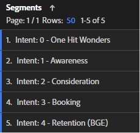
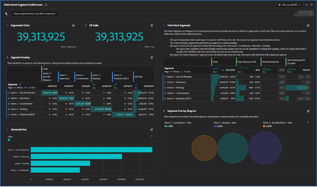
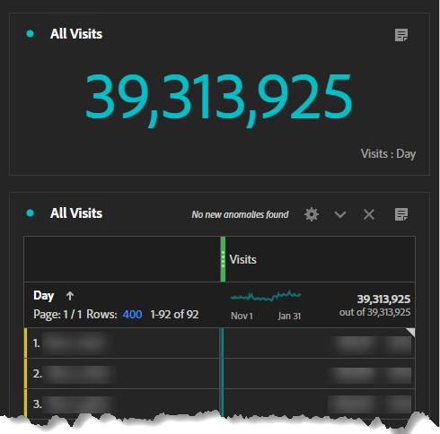
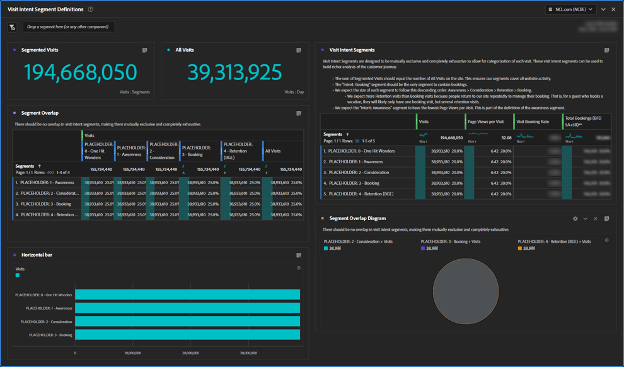
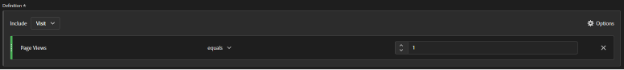
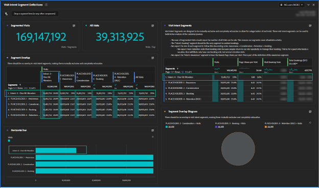

# カスタマージャーニーセグメントの作成

Adobe Experience Cloudを利用して、行動ベースのカスタマージャーニーセグメントを構築し、Adobe Analyticsで顧客体験を向上させる方法を、ステップバイステップで解説します。

より優れたカスタマージャーニーセグメントを構築しましょう！ このシリーズでは、Adobe Analyticsを使用して、行動ベースのセグメントの定義、オーディエンスサイズの推定、ユーザーの動きの追跡を行います。 最終的には、Adobe Adobe Experience Cloudを活用して、メディアをパーソナライズし、顧客体験を向上させることができます。 これらのセグメントは現在も存在するため、顧客の詳細を把握したら更新する必要があります。 レポートには課題が伴う場合もありますが、ご安心ください。ガイドさせていただきます。 「One Hit Wonders」セグメントから始まる、最初の顧客ジャーニーセグメントを作成することから始めましょう。

本日は、最初の顧客ジャーニーセグメントのプレースホルダーを作成し、セグメントの定義に役立つAdobe Analytics Workspaceを構築し、最初のセグメントである「One Hit Wonders」を定義します。

このシリーズで解説する前に、Adobe Adobe Analyticsを利用して、行動シグナルにもとづいてカスタマージャーニーのセグメントを構築できます。 カスタマージャーニーの各ステージにおける各オーディエンスの規模を推定し、各ステージの間で利用者がどのような割合で移動しているのかを把握できます。 また、これらのカスタマージャーニーのオーディエンスをAdobe Experience Cloudにエクスポートし、パーソナライゼーションとメディアターゲティングを有効にすることができます。

企業ごとに異なるため、カスタマージャーニーのセグメントも私のものとは異なります。 セグメントに特化した数式を規定するのではなく、いくつかの留意事項や、セグメントを構築するための全体的なプロセスを提案しましょう。

また、カスタマージャーニーのセグメントは、リビングセグメントになることも重要です。 この演習は一回限りの作業ではありません。 顧客について詳しく知りたい場合は、これらのセグメントを更新します。 これには、レポート作成に関するいくつかの課題があります。 人々はレポートの一貫性を求めています。セグメントの定義が変更されると、レポートの数値も変更されます。

## 訪問インテントセグメントを始める

カスタマージャーニーセグメントを構築するための最初のステップは、行動シグナルや、可能であれば顧客データの声を活用して、顧客がweb サイトを訪問している理由を推測することです。 ここでは、訪問者のインテントセグメントを作成し、web サイトへのあらゆる訪問を分類します。 この時点で、「訪問インテント」セグメントは、相互に排他的で完全に網羅的である必要があります。 すべての訪問は1つに属し、1つだけ訪問インテント セグメントに属する必要があります。

訪問インテントセグメントは訪問を表すので、セグメント定義で訪問コンテナを使用します。

私が最初に設定した訪問インテントセグメントには次のものが含まれます。

* ワンヒット・ワンダーズ
* 認知
* 考慮事項
* 予約（購入）
* リテンション（予約/購入の管理）

私の訪問インテントのセグメントを使いやすくするために、セグメント名に「Intent:」というプレフィックスを付け、並べ替えを有効にする番号を付け、「intent」というタグを付けました。 私のセグメントは下の写真のようでした。

**ページビュー>= 1のプレースホルダー定義を持つ訪問コンテナを使用して、訪問インテントセグメントを作成します。**

このように、セグメントの構築は、反復的かつ相互に関連するプロセスです。 これらのセグメントを構築するプロセスについては、後の記事で説明します。

## The Visit Intent Segment Data Quality Workspace

シンプルなワークスペースを使用して、訪問の意図セグメントを適切に定義できました。 各訪問は1つに属する必要があり、訪問の意図セグメントは1つのみである必要があることを忘れないでください。 設定したワークスペースでは、すべての訪問が考慮され、セグメント間に重複がないことを確認します。

このワークスペースに「データ品質：インテントセグメントを訪問」という名前を付け、「データ品質」、「訪問インテント」、「カスタマージャーニー」というタグを付けました。 後で、「訪問インテント ダッシュボード」を作成します。このワークスペースがセグメントの設定とメンテナンス用であることを示すプレフィックス「DATA QUALITY」が表示されます。 Insightほどビジネス的に小規模なダッシュボードですが、セグメントを確実に維持するうえで重要です。 セグメントを正しく定義しておくために、このダッシュボードに定期的に戻ったり、アラートを設定することをお勧めします。

このワークスペースで最も重要なビジュアライゼーションは、左中の「セグメントの重なり」フリーフォームのビジュアライゼーションです。 訪問指標を使用して、訪問インテント セグメントごとに列フィルターを作成し、右端の列にすべての訪問セグメントを追加します。 左側の各訪問インテントセグメントに行を作成します。 これで、タブ間のビジュアライゼーションができました。 セグメントが正しく設定されている場合、各訪問インテントセグメントと自体との交点に、1列と1行のデータのみが存在します。

次に重要なビジュアライゼーションは、左上の概要指標です。 セグメント化訪問の概要は、すぐ下のセグメント重複ビジュアライゼーションの「すべての訪問」列からその値を取得します。 すべての訪問の概要には、独自の非表示テーブルがあります。

右上に、各セグメントに追加の指標を追加して、セグメントがどのように形成されているかに「フレーバー」を加えました。 特に、これらのセグメントは相互に排他的であるため、予約インテントセグメントの予約のみが表示されることを期待しています（恐れることはありません、これらの訪問インテントセグメントを訪問者ベースにするとコンバージョン率が向上します。

ここでプレースホルダーセグメントを作成しました。 最初は、作業空間が奇抜に見えます。 同じ定義を持つため、すべての訪問インテントセグメントは100%重複します。 これは正しく、プロセスのこの時点で見たいものが正確に表示されます。 セグメント定義を作成するにつれて、これらのセグメントが形を整え始めます。

## 初めての訪問インテントのセグメントを作成する

訪問インテントセグメントの定義は、排除プロセスの一部であり、それらの間には多くの相互依存関係があります。 セグメントをジャーニーの順序に合わせて構築するのではなく、最も定義しやすいものから最も難易度の高いものまで順番に構築しました。 それは私に次の命令を下した。

1. 意図：0 - ワンヒットの不思議
1. 意図：3 – 予約
1. 意図：4 – 保持
1. 意図：2 – 検討
1. 意図：1 – 認知度

かなり無作為だな？ これらの訪問インテントセグメントの定義は、反復的で行き来するプロセスであり、多くの場合、あるセグメントを調整するために他のセグメントを更新する必要がありました。 各セグメントの定義方法を説明することで、より明確になります。

このセッションでは、最初の、最も簡単なセグメントを

## 「One Hit Wonders」セグメントを構築

私の最初のセグメントである「One Hit Wonders」は定義しやすかったです。 単一のページビューを利用すれば、 そのユーザーがweb サイトにアクセスした理由は分かりません。 入口ページから意図を推測することはできても、ページビューがひとつしかないため、意図を十分に理解した上で推測できるような情報を得ることはできません。

このセグメントを定義すると、訪問インテントWorkspaceが形を取り始めます。

Adobe Analyticsを利用してカスタマージャーニーのセグメントを構築することは、困難ではあるものの、やりがいのあるプロセスです。 行動ベースのセグメントを作成し、オーディエンスサイズを推定して、ユーザーの動きを追跡することで、メディアをパーソナライズし、顧客体験を向上させることができます。 企業の個性は異なり、セグメントを作成するための具体的な式はなく、ガイドラインとプロセスがあります。 顧客の詳細情報を把握したら、セグメントを更新する必要があります。これにより、レポート上の課題が発生します。 訪問インテントセグメントを構築するプロセスに従うことで、全体的な顧客体験を向上させることができます。

## 作成者

このドキュメントの作成者：

**Aaron Fossum**、デジタルアナリティクス担当ディレクター

Adobe Analytics チャンピオン
