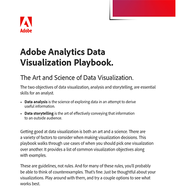

# Adobe Analytics Data Visualization Playbook

データの可視化はアートであると同時にサイエンスでもあるため、さまざまな要素を慎重に検討する必要があります。 この意思決定の一部を適切に進めるために、データビジュアライゼーションプレイブックをまとめました。

[Adobe Analytics Visualization Playbookをダウンロード ](assets/adobe-analytics-data-visualization-playbook.pdf)

一般的なビジネス上の質問に取り組む場合でも、複雑な分析に取り組む場合でも、この包括的なプレイブックでは、さまざまなビジュアライゼーションをいつ、どのように効果的に使用するかを示す、さまざまなユースケースを紹介しています。

## 作成者

このドキュメントはDavid Geistが作成しました，
Adobeのデータおよびインサイト担当ビジネスコンサルタント。
