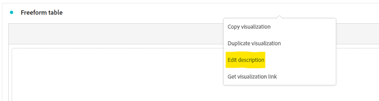
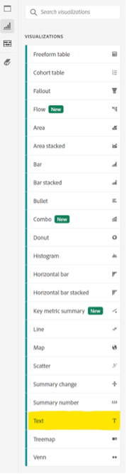
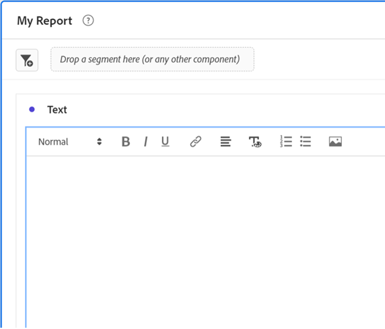
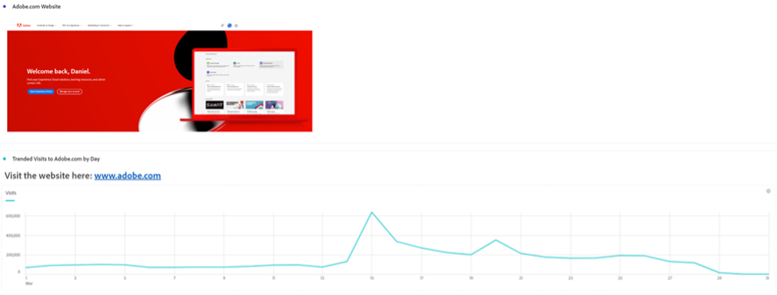

# 単語以上 – Analysis Workspaceでのテキストビジュアライゼーションと説明の使用

Adobe Analytics Analysis Workspaceを利用している企業は、データとデータビジュアライゼーションに重点を置くことが自然です。誰でも要約を入力できます？ しかし、テキストのビジュアライゼーションやビジュアライゼーションの説明など、Analysis Workspaceの機能を見落とすと、インサイトを価値のあるテキスト、画像、GIF、リンクと組み合わせる貴重な機会を逃す可能性があります。 データの意味を利用者に伝えるために参考文献やより多くのコンテキストを提供することで、データをより効果的かつ効果的なものにすることができます。

まず、次の機能について、必要な機能を確認しましょう。

- ビジュアライゼーションの説明を追加または変更するには、要素の上部領域を右クリックし、「説明を編集」リンクを選択します。

  

- 別のテキストパネルを追加するには、左側のナビゲーションバーのビジュアライゼーションメニューをクリックします。

  

このガイドでは、これらの2つの方法のいずれかを使用した例を示していますが、説明とテキストのビジュアライゼーションの両方で同様の追加を行うことができます。 また、フォントのピッチ、整列、カラーを調整し、箇条書きや自動番号リストを作成することもできます。

では始めましょう。 Analysis Workspace プロジェクトに追加する非常に有用なコンテキストの1つは、ハイパーリンクです。これには、レポートで詳細に説明されているページのURL、他のAnalysis Workspace プロジェクトへのリンク、外部レポートのコンテキストページなど、レポートを表示する際に役立つ可能性のあるその他のページへのリンクが含まれます。 この機能は、テキストの任意の部分を選択し、「リンク」アイコンを選択することでアクセスできます。

その結果、Analysis Workspace プロジェクトを表示しているすべてのユーザーが、オンラインまたは組織のイントラネットでアクセス可能なあらゆるページに、ワンクリックでアクセスできるようになります。

コンテンツをレポートに直接取り込む場合は、画像リンクを使用して、データに沿ってコンテンツを配置できます。

パブリック URLでアクセス可能な画像をレポートに追加できます。URLが&#x200B;*https*&#x200B;形式で、.png、.jpeg、.jpg、または.gif形式である限り、制限があるように聞こえますが、imgurやGIPHYなどの画像やGIFを共有するために使用されるオンラインツールでは、Share Linkを使用してWorkspaceにアクセス可能なファイルをアップロードする簡単な方法を提供できます。

その成果として、 データが直接参照しているweb ページをプロジェクトで表示できます。

プロジェクトでGIFを使用して、サイトのウォークスルー、サイト内の理想的なパス、アプリ上のタスクなどの動く画像を含めたり、レポートが&#x200B;***心を揺さぶる***&#x200B;状態になったことをチームに示したりすることもできます。

## 作成者

このドキュメントの作成者：

McDonald’s Corporation、シニア製品エンジニアリング分析マネージャー、**Dan Cummings**

Adobe Analytics チャンピオン
