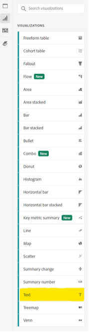

# 単語以上 — Analysis Workspaceでのテキストのビジュアライゼーションと説明の使用

Adobe Analytics Analysis Workspaceのユーザーは、多くの場合、フォーカスがデータやデータの視覚化に移るのは自然です。誰でも概要を入力できます。 ただし、Analysis Workspaceのテキストビジュアライゼーションやビジュアライゼーションの説明などの見落とし機能は、インサイトを貴重なテキスト、画像、ギフ、リンクと組み合わせる貴重な機会を逃している可能性があります。 参照やより多くのコンテキストを指定して、データの意味をユーザーに知らせることで、より効果的で効果的なデータを作成できます。

まず、次の機能の見つけ方を確認します。

- ビジュアライゼーションの説明を追加または変更するには、要素の上部の領域を右クリックし、「説明を編集」リンクを選択します。

   

- 別のテキストパネルを追加するには、左側のナビゲーションバーのビジュアライゼーションメニューをクリックします。

   

このガイドでは、これら 2 つの方法のいずれかを使用した例を示しますが、説明とテキストのビジュアライゼーションの両方で、類似した追加をおこなうことができます。 フォントのピッチ、整列、色、箇条書きリストまたは番号付きリストの作成も行えます。

それでは、始めましょう。Analysis Workspaceプロジェクトに追加するときに非常に役立つコンテキストの 1 つは、ハイパーリンクです。ハイパーリンクには、レポートで詳しく説明されるページの URL へのリンク、他のAnalysis Workspaceプロジェクトへのリンク、外部レポートコンテキストページなど、レポートの表示に役立ちます。 この機能にアクセスするには、テキストの任意の部分を選択し、「リンク」アイコンを選択します。

その結果、Analysis Workspaceプロジェクトを表示しているすべてのユーザーが、1 回のクリックで、オンラインまたは組織のイントラネット内でアクセス可能な任意のページに到達できます。

コンテンツを直接レポートに取り込む場合は、「画像」リンクを使用して、コンテンツをデータと共に配置できます。

URL がにある限り、任意のパブリック URL でアクセス可能な画像をレポートに追加できます *https* 形式で、.png、.jpeg、.jpg、.gif 形式です。ただし、画像やGIFの共有に使用されるオンラインツール（例：imgur、GIPHY）では、Share Link を使用して Workspace にアクセス可能なファイルを簡単にアップロードできます。

結果は？ データが参照している Web ページをプロジェクト内に直接表示できます。

また、プロジェクトでGIFを使用して、サイトのウォークスルーや理想的なパス、アプリ上のタスクなどの動画を含めたり、チームにどのように表示するかを示すこともできます ***驚くべき*** レポートは次のようになりました。

## 作成者

このドキュメントの作成者：

**ダン・カミングス**, McDonald&#39;s Corporation の Sr. Product Engineering Analytics Manager

Adobe Analytics チャンピオン

