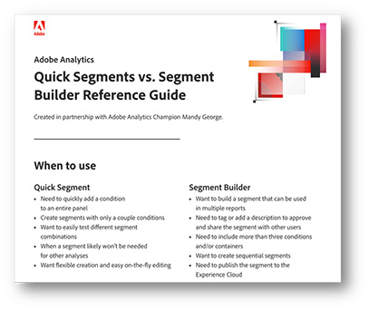

# Analysis Workspaceのセグメントビルダーとクイックセグメントの違い

セグメントは、データ分析ツールキットで最も強力なツールの 1 つになります。 セグメントビルダーを使用する場合と、Analysis Workspaceで迅速なセグメントを使用する場合の違いについて説明します。

>[!TIP]
>
> ページ下部の画像をクリックすると、Analysis Workspaceの各ツールをいつ使用すればよいかに関する便利なリマインダーをダウンロードできます。

セグメントは、データ分析ツールキットで最も強力なツールの 1 つになります。 特定のトラフィックグループ、サイトセクション、またはカスタマージャーニーを確認する場合、セグメントを使用すると、分析をサイトの特定のトラフィックサブセットに焦点を当てることができます。 小売環境から取得した、新規顧客と既存の顧客、アカウントとゲストにサインインした顧客など、様々なタイプの顧客グループに対して最も役立つセグメントがいくつかあります。 しかし、異なるサイトセクションや、特定のアクションを実行する顧客、その他の考えられる事項に対しても作成できます。

**セグメントを作成する主な方法は 2 つあります。**

* コンポーネントメニューでのセグメントビルダーの使用
* パネル上部のクイックセグメントの使用

セグメントビルダーを使用してセグメントを作成した場合は、保存して、他のプロジェクトで再利用できます。 これは、特定の顧客グループ（サイトの特定のセクションを訪問して購入する人など）に焦点を当てるのに最適です。 一方、探索的分析を行っていて、別のセグメント設定をテストする場合は、クイックセグメントビルダーを使用すると便利です。 各方法の主なメリットをいくつか見てみましょう。

## クイックセグメント

各パネルの上部で、クイックセグメントアイコン（ +記号の付いたファネル）をクリックして、ビルダーを開くことができます。 これにより、任意のレベル（ヒット、訪問または訪問者）で、最大 3 つの条件を持つセグメントを作成できます。 メインのセグメントビルダーと同様、右側でも、セグメントがデータを返しているかどうか、およびセグメントに含まれる全体的なトラフィック母集団の割合を示します。ただし、これは、セグメントビルダーに表示される完全なセグメント体積ビューよりも簡略化されています。 複数の条件を追加する場合、「and」および「or」演算子を使用できます。 残念ながら、クイックセグメントには「then」オプションがないので、順次セグメントが必要な場合は、完全なセグメントビルダーを使用する必要があります。 また、クイックセグメントには 1 つのコンテナの制限もあります。 これは、すばやく作成および編集できる基本的なセグメントに使用するためのものです。 クイックセグメントをパネルに適用したり保存したりすると、パネル内で編集できなくなります。

探索的分析を行う際に、様々なタイプのセグメントをテストして、様々な顧客グループの反応や異なるカテゴリのパフォーマンスを確認したい場合。クイックセグメントを使用すると、セグメントビルダーを使用する場合よりもはるかに高速です。 また、これらのセグメントは、作成元のプロジェクトでのみ使用できるので、必要な結果が得られない場合は、マスターリストから保存したセグメントを削除するかどうかを気にする必要はありません。 他のプロジェクトで役立つと認識したセグメントをテストした後で、いつでも「ビルダーを開く」ボタンをクリックして、セグメントを完全なセグメントビルダーで開き、通常のセグメントとして保存できます。 ただし、一度編集すると、クイックセグメントビルダーで編集できなくなります。

## セグメントビルダー

セグメントビルダーにアクセスするには、左側のコンポーネントメニューでセグメントのリストの上にある+記号をクリックするか、コンポーネントドロップダウンをクリックして「セグメントを作成」を選択します。クイックセグメントとは異なり、すべてのオプションを使用できます。 複数の条件を追加する場合は、「then」演算子を使用して順次セグメントを作成できます。 順次セグメントでは、（ヒット、訪問または訪問者の代わりに）「論理グループ」をレベルとして使用することもできます。 また、セグメントビルダーでは、セグメントの作成者やフィルター対象のデータタイプに関するコンテキストをセグメントに追加したり、単に「タグ」をセグメントに追加したりできます。

コンテナを使用する必要がある場合や順次セグメントが必要な場合、セグメントに 3 つ以上の条件が設定される場合は、セグメントビルダーの使用が不可欠です。 完全なセグメントビルダーには、より複雑なセグメントを作成するための多くのオプションが用意されており、様々な顧客タイプ、カテゴリ、カスタマージャーニーなどを分類するのに役立ちます。 これらのセグメントを作成して保存すると、セグメントのマスターリストに追加されます。つまり、セグメントはタグ付け、承認、共有、複数のレポートで使用し、Experience Cloudに公開できます。 Experience Cloudに公開すると、そのセグメントを他のAdobe製品 (Adobe Targetなど ) で利用して、パーソナライゼーションのターゲティングをおこなうことができます。 セグメントビルダーで作成したセグメントは、クイックセグメントパネルで編集できません。セグメントビルダーを開いて変更する必要があります。 幸いにも、右側のプレビュービジュアライゼーションでは、過去 90 日間にセグメントで発生したトラフィックをより詳細に分析できます。つまり、保存する前に、セグメントで必要な内容を取り込むほうが簡単です。

## ユースケース

様々な業界で、カスタムセグメントの作成にが使用する方法が異なる場合があります。 大規模小売業者の e コマース部門に向けて、多くの場合、調査分析を実行し、顧客が購入するためにたどるパスを特定します。 商品を買い物かごに追加したり注文をするなど、アクションの急増や急減が見られる場合は、クイックセグメントを使用すると便利です。 分析中に、特定のタイプの顧客や、訪問者がクリックした特定のアクション/リンクのセグメントをすばやく作成できます。 セグメントビルダーを開いて各セグメントを保存する必要がなくなったので、条件をすばやく追加して、同じようにすばやく削除できます。 これにより、サイトで変更がなぜ起こるのかを説明しようとする際に、多くの時間を節約できます。

または、セグメントビルダーが私の目標となった場合もあります。 すべての顧客が同じではなく、多くの場合、顧客がたどるアクションやパスで識別される、特定のタイプの顧客を調べたいと考えています。 セグメントビルダーを使用して、複数の条件を追加し、異なるタイプの顧客を特定して保存し、複数のアナリストが共有して使用できるようにします。 レポート間でこれらのタイプのセグメントの一貫性を保つことが重要です。そのため、結果が異なる場合があるので、誰でも使用できるセグメントを構築する方が、各ユーザーが独自のバージョンを構築するよりも適しています。

全体的に、クイックセグメントとセグメントビルダーの両方が、分析で使用する優れたツールです。 それぞれの目的、利点、欠点があります。 クイックリファレンスガイドについては、以下の便利なダウンロード可能なヒントとテクニックのシートを確認してください。

## 作成者

このドキュメントの作成者：

**マンディ・ジョージ**, Digital Analyst III （ベストバイカナダ）

Adobe Analytics Champion

## ダウンロード

