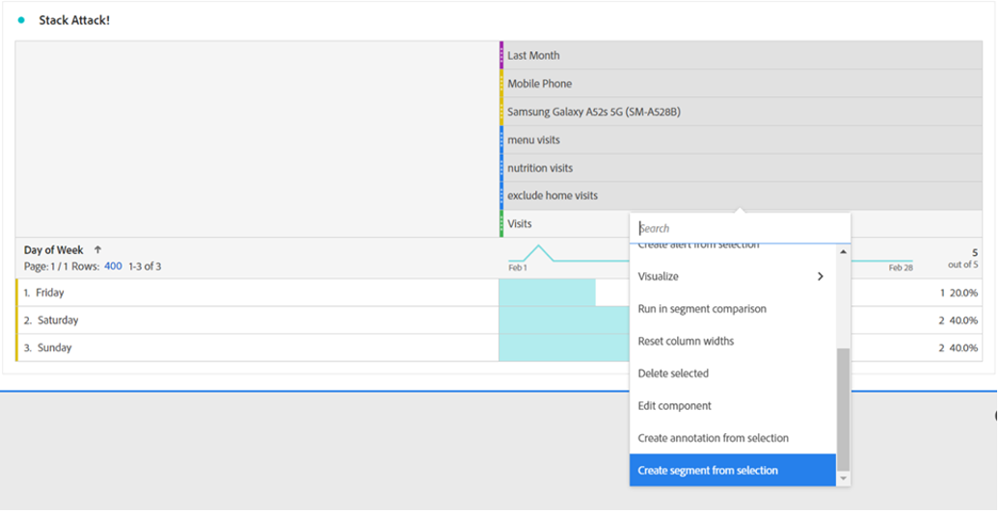
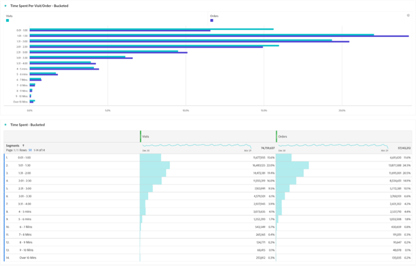
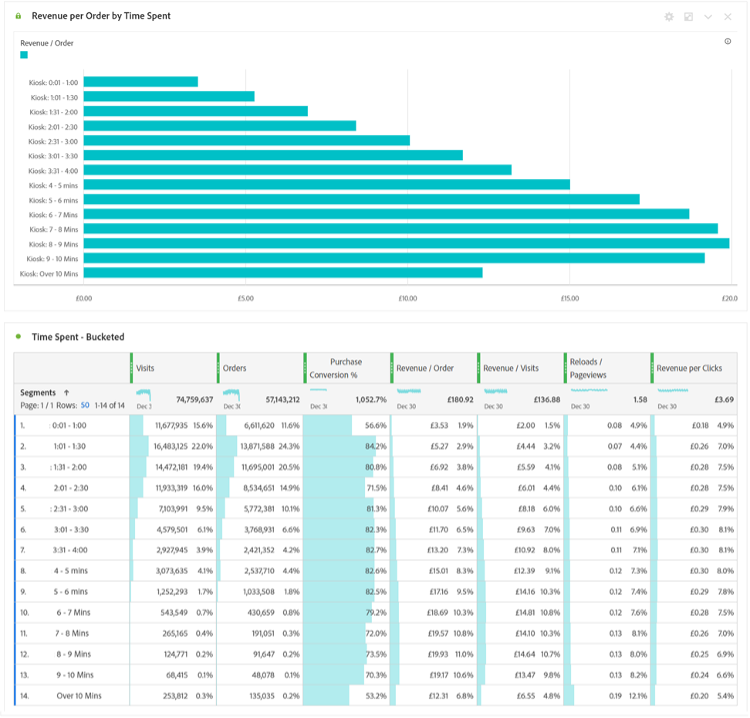

# セグメントを利用して、Analysis Workspaceの新しいインサイトを発見する

Adobe Analyticsを初めて利用する場合でも、熟練の担当者である場合でも、Analysis Workspaceプロジェクトではセグメントを十分に活用できます。 [Adobe Experience League](https://experienceleague.adobe.com/docs/analytics/components/segmentation/seg-overview.html?lang=ja)が説明するように、「セグメントを使用すると、特性やweb サイトのインタラクションに基づいて訪問者のサブセットを識別できます。」 この機能の基本的な結果は、ユーザー、訪問、またはサイトへのヒットのグループを分離することを意味しますが、あなたのような鋭い考えを持つアナリストは、このツールを使用して創造性を発揮し、サイトのアクティビティに関するインサイトを得るための新しい方法を見つけることができます。 選択肢の選択肢は膨大であるため、躊躇せずに独自の選択肢を作成し、組織の他のメンバーや、Experience Leagueの[Adobe Analytics コミュニティ &#x200B;](https://experienceleaguecommunities.adobe.com/t5/adobe-analytics/ct-p/adobe-analytics-community?profile.language=ja)や[Slack](https://www.measure.chat/) コミュニティなどのコミュニティでオンラインで共有し#Measureください。

セグメントの作成方法に関するクイックリフレッシュが必要な場合は、Analysis Workspaceでの[&#x200B; セグメントビルダー](https://experienceleague.adobe.com/docs/analytics/components/segmentation/segmentation-workflow/seg-build.html?lang=ja)の使用に関するExperience Leagueのドキュメントをご覧ください。

## セグメントの比較と比較

Analysis Workspaceでは、「[&#x200B; セグメント比較](https://experienceleague.adobe.com/docs/analytics/analyze/analysis-workspace/panels/segment-comparison/segment-comparison.html?lang=ja)」を使用して2つのセグメントを比較できます。 セグメントの比較は、左側のナビゲーションバーの「パネル」セクションで確認できます。

しかし、重要なインサイトをエンドユーザーに提供するために、完全な比較パネルが必要ない場合もあります。 ありがたいことに、一部の機能は標準パネルでも比較できます。

[&#x200B; ベン図ビジュアライゼーション &#x200B;](https://experienceleague.adobe.com/docs/analytics/analyze/analysis-workspace/visualizations/venn.html?lang=ja)を使用すると、簡単な比較を作成でき、2～3個のカスタムセグメント間の重複するセッション、注文、ユーザーなどをホバーして表示できます。 また、次の重なり合うセクションのいずれかを右クリックして、セグメントをすばやく作成することもできます。

重なり合うデータではなく、重なり合わないデータが重要な情報になることもあります。 これを表示する簡単な方法は、1つのセグメントのコピーを作成し、それを「除外」セグメントにすることです。

「除外」セグメントを比較の他のセグメントと積み重ねることで、同じセッションでホームページを表示することなく、メニューページにアクセスした訪問者数をすばやく計算できるようになりました。

## スタック攻撃

同様に、任意のセグメントを積み重ねるだけで、ベン図の交差データを作成できます。 セグメントや個々のディメンションをスタックする数に制限はありません。 例えば、私のサイトが携帯電話、特にSamsung Galaxy A52sで訪問した先月、メニューや栄養ページは表示されていたものの、ホームページは表示されていなかったことを簡単に確認したい場合、次のように即座に作成できます。

しかし、ユーザーや訪問ベースの完全なサブセットを見つけたら、これらすべての値を選択して右クリックし、即座にセグメントを作成できます。

1つのセグメントで非常に強力です。

## セグメント数の数値のセグメント

多くの利用者は、セグメントを構築する際に、名目、序数、間隔の値を見ることがよくあります。例えば、訪問したページ、利用者の年齢、過去に利用者が訪問した回数などです。 ただし、比率データを使用してセグメントを作成する場合は、標準ディメンション、標準指標、または組織のカスタム変数や指標など、これらの値をグループ化して使用することもできます。

例えば、「ページ滞在時間」または「訪問当たりの滞在時間」には、事前に構築されたバケットが用意されています。

ただし、組織のニーズに必ずしも適合しない場合があります。おそらく、サイトへの訪問の多くは、10分以内に行われるのでしょう。 きめ細かい測定により、さまざまなサイズのバケットを作成できます。 以下は、1分、1秒、1分、30秒の間の訪問を確認するために作成されたものです。

作成したら、カスタマイズした様々なグループ別の訪問、注文、その他のイベントを確認できるようになりました。

利用者がどれくらいの時間を費やし、どれくらいのページを閲覧したか、過去に閲覧した回数、その他の数値であるかなどの要因として、KPI （主要業績評価指標）がどのように変化するかを調べ始めることもできます。基本的には、指標を別の指標の要素として見ることができます。

セグメントを活用して新たなインサイトを獲得する可能性は、無限にあります。 これは基本的なユースケースです。 Experience Leagueの[Adobe Analytics コミュニティ &#x200B;](https://experienceleaguecommunities.adobe.com/t5/adobe-analytics/ct-p/adobe-analytics-community?profile.language=ja)または[Slack](https://www.measure.chat/) コミュニティで見つかったものをコミュニティに知らせて、いくつか試し#Measureみてください。

ハッピーセグメンテーション！

## 作成者

このドキュメントの作成者：

McDonald’s Corporation、シニア製品エンジニアリング分析マネージャー、**Dan Cummings**

Adobe Analytics チャンピオン
