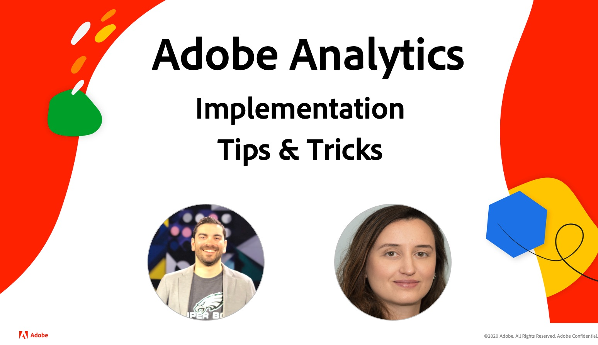

# Experience League LIVE

## 次のエピソードにご参加ください。

Experience League LIVE は、Experience League チームが制作したライブストリーミングショーです。  アドビ製品の専門家とつながり、Adobe Experience Cloud アプリケーションで適用できる実用的なヒント、テクニック、戦略を学ぶ機会です。

## 近日開催予定の Experience League LIVE イベント

<table>
<tr>
  <td>
      
     

          <strong>カスタマージャーニー</strong>
     

     

          <em>2021年9月</em>
     

    

    <em>製品エキスパートから、顧客に応じたリアルタイムのエクスペリエンス構築を説明します</em>
    

  </td>
  <td>
      
     

          <strong>コンテンツとコマース</strong>
     

          <em>2021年10月</em>
     

     

    

    <em>パーソナライズされたコマースエクスペリエンスを拡大・縮小して構築する際のコンテンツの作成および管理方法を説明します</em>
    

  </td>
  <td>
      
     

          <strong>Experience Platform</strong>
     

     

          <em>2021 年 12 月 日</em>
     
    
    

    <em>製品エキスパートが、顧客に応じたリアルタイムのエクスペリエンス構築を説明します</em>
    

  </td>
</tr>
</table>

## 過去のエピソード

Experience League LIVE のエピソードを見逃しましたか？ ご安心ください。 過去のエピソードをご覧ください。

<table>
<tr>

<td>
    
     

          <strong>ゲスト</strong>：<i>エリック マチソフとダシャ フィッツパトリック</i>
     

     

          <em>2021 年 7 月 29 日（PT）</em>
     
    
    

    <em></em>
    

  </td>
</tr>
</table>

>[!TIP]
>
>その他の学習方法については、無料の[コース](https://experienceleague.adobe.com/ja?lang=ja#dashboard/learning)と、個別の[チュートリアル](https://experienceleague.adobe.com/docs/home-tutorials.html?lang=ja)をご覧ください。
