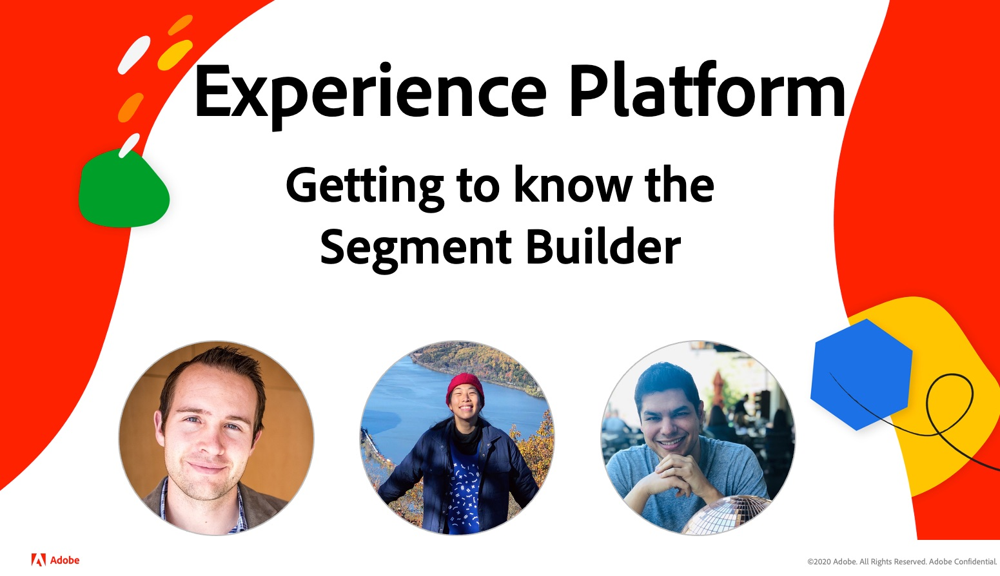

# Experience League LIVE

Experience League LIVE は、Experience League チームが制作したライブストリーミングショーで、Experience Cloud アプリケーション、アプリケーションサービス、Adobe Experience Platform に適用できる実用的なヒント、テクニック、戦略を提供します。

## 次のエピソード：Experience PlatformとリアルタイムCDP!

*エピソードゲスト：* アーロンシールド、ヤヤ・ワン、アンドレス・モンロ
***イ・マーク日付！*** 8 **月26日（木）に太平洋** 時間( **午** 前9時)に予定

## 今後のエピソード

Experience LeagueLIVEの次のエピソードに興奮！

<table>
<tr>
  <td>
    
  </td>
  <td>
    <strong></strong>
  </td>
  <td>
    <strong></strong>
  </td>
</tr>
<tr>
  <td>
    <strong>アプリ：</strong> Adobe 
    <strong>キャンペーンの日付：</strong> 2021年9月 
    <strong>トピック：</strong>  
    <strong>TBDGuests:</strong> TBD
  </td>
  <td>
    <strong>アプリ：</strong> Adobe Experience  
    <strong>Managerの日付：</strong> 2021年10月 
    <strong>トピック：</strong>  
    <strong>TBDusts:</strong> TBD
  </td>
  <td>
    <strong>アプリ：</strong> Adobe Experience  
    <strong>Platform日付：</strong> 2021年11月 
    <strong>トピック：</strong>  
    <strong>TBDusts:</strong> TBD
  </td>
</tr>
</table>

## 過去のエピソードの再生

Experience League LIVE のエピソードを見逃しましたか？ご安心ください。過去のエピソードを見ることができるリンクはこちらです。

<table>
<tr>
  <td>
     
    <b>主催者：</b> <i></i> 
    <b>DougGuests:</b> <i>Eric Matisoff and Dasha </i> 
    <b>FitzpatrickHared:</b> <i>2021年7月29日</i>

</td>

</tr>

</table>

>[!TIP]
>
>その他の学習方法については、無料の[コース](https://experienceleague.adobe.com/?lang=ja#home)と、個別の[チュートリアル](https://experienceleague.adobe.com/docs/home-tutorials.html?lang=ja)をご覧ください。
