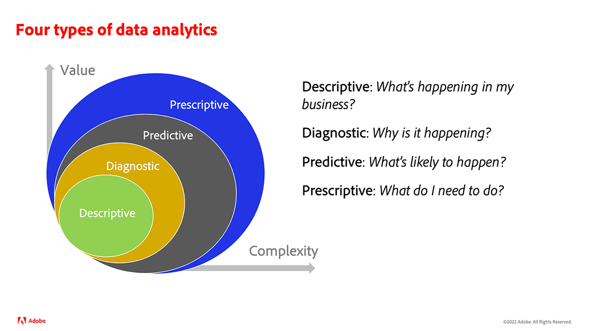

# 分析とは {#what-is-analytics}

コンテンツに没入して Adobe Analytics を学ぶ前に、「分析とは何か？」というこの基本的な質問に対する答えを理解しておくと役に立ちます。Analytics（分析）は、ビジネスの開発と変革を推進する複数の分野、すなわちビジネス分析とデータ分析を含む幅広い用語です。この 2 つは明確に区別されます。より詳しく見てみましょう。

## ビジネス分析の役割

近年、インターネットの商業目的での使用が生まれて成熟度が爆発的に高まり、消費者の動向や消費者のブランドとの関わり方をについて、組織が蓄積するデータ量も増加しています。よく耳にする「ビッグデータ」という用語は、ビジネス分析の領域に含まれます。

ビジネス分析は、ビジネスインテリジェンスのコンポーネントであり、戦略的リスクと隠された機会の全体像に焦点を当てています。企業がその業界で競争力を保つために必要不可欠な能力です。

ビジネス分析には、次の 4 つのタイプがあります。

* **記述的**：履歴データを使用して組織のビジネスの傾向を把握します。例えば、小売業では、ピークシーズンやホリデーシーズンの前に製品の需要を予測し、ビジネス目標を達成するために最適な在庫を確保する必要があります。
* **診断的**：予期しない結果の背景には、どのような理由があるか。なぜ、オフシーズンに製品やサービスに対する需要が劇的に高まったのか。診断分析は、より深い記述的な分析形態で、データから相関関係を引き出すことを目的としています。
* **予測**：履歴データを使用して、推定される結果やイベントを判断します。予測の精度を上げるために、機械学習（ML）や人工知能（AI）が一般的に利用されています。顧客離れ率は、予測分析の実際の応用例です。この分析により相関関係を見出し、離脱する可能性が高い顧客の属性を特定することで、それを防ぐための対策を講じることができます。
* **規範的**：望ましい結果への最良の道筋を見つけ出すことを目的とした、予測分析を進化させた形式の分析です。このタイプの分析では、ML や AI のテクノロジーも使用されています。小売業者は、規範的な分析を使用して、オペレーションを変更することで利益率を向上させます。

## データ分析の役割

データ分析では、ビジネス分析で使用されているのと同じテクノロジーの多くを使用しますが、より範囲が広く、より技術的な性質を持っています。 例えば、ビッグデータ分析は、データの品質と構成に依存しています。 データの並べ替え、保存およびクレンジングの効果はどの程度ですか？ データサイエンティストは、データ分析の分野で作業をします。 データサイエンティストが大量のデータセットを変換し、そのデータセットをビジネスアナリストが使用して、組織に情報を伝達してプロセスと指標を最適化します。 データサイエンティストは、データをさらに深く掘り下げて、傾向と関連性を決定します。

## Adobe Analytics はどこに適合しますか？

Adobe Analytics は、カスタマージャーニーをサポートするマルチチャネルデジタルエクスペリエンスからデータを収集し、データを分析するためのツールを提供する、堅牢なデータ分析プラットフォームです。 ビジネス分析の目的でマーケターやビジネスアナリストが一般的に使用するプラットフォームです。

ビジネス要件、データ設計およびデータ収集が、効果的な分析プラクティスの重要な要因になります。 顧客は最初、web やモバイルなどの従来のデジタルエクスペリエンスの主要なカスタマージャーニーと目的とするビジネス成果に関するデータの収集から始めます。 データは、次のような質問に回答する必要があります。

* 「訪問者に人気のあるコンテンツとコンテンツタイプはどれか？」
* 「売上高、予約数、リード、購読など、高価値のコンバージョンにつながるのは、どのパスか？」
* 「既知の訪問者と不明な訪問者に表示する必要があるのは、どの製品、サービスまたはコンテンツか？」
* 「デジタルマーケティングチャネルのパフォーマンスはどうか？」

データ基盤が Adobe Analytics に収集されると、マーケターやビジネスアナリストは、製品で使用できる様々なレポートやデータビジュアライゼーションツールを使用して分析を実行し、データに関する有意義なストーリーを伝えます。 さらに、Adobe Analytics は様々な形式の出力を提供します。A/B テストを実行するために、Adobe Target などの最適化ツールに送信されるセグメントやオーディエンスにすることができます。モデリングのために別のシステムで使用される、ユーザーによるアクションの可能性を示す予測スコアである可能性があります。

時間の経過と共に、顧客は、CRM、コールセンター、実店舗、音声アシスタントなどの他のチャネルソースを使用して、従来の web およびモバイルデータを充実させます。Adobe Analytics では、事実上あらゆるチャネルソースからデータを取り込んで堅牢な分析データ基盤を構築するための方法が複数用意されています。

追加のデータセットを収集すると、マーケティングアトリビューションや異常値検出などの、機械学習や高度なデータモデルを使用する、より高度なタイプの規範的データ分析を実行できます。

Adobe Analytics の主なメリットと機能を順を追って説明する Experience League のチュートリアルを利用することをお勧めします。
