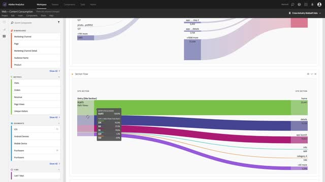

# Analytics チュートリアル

[!DNL Adobe Analytics] を最大限に活用しましょう。 これらのチュートリアルを使用して Analytics の機能を習得し、ビジネスにとってのメリットを享受しましょう。 このコンテンツは、管理者、データアナリスト、マーケター、開発者およびアーキテクトに適しています。

開始するには、Dynamic Tag Management アカウントで

* 最新のアップデートと機能については、以下の&#x200B;**「新機能」**&#x200B;の節を参照してください。
* **スタッフのおすすめ**&#x200B;ではお気に入りのコンテンツをいくつか紹介します。
* **左側のナビゲーション**&#x200B;でトピックとサブトピック別のコンテンツをご覧ください。
* 検索対象がわかっている場合は、ページ上部の「**検索**」フィールドを使用します。

コースセクションでは、役割別およびスキルレベル別にキュレーションされた学習体験も用意しています。 Adobe ID を使用してログインし、上部ナビゲーションで&#x200B;**学ぶ／おすすめのコース**&#x200B;に移動します。

## スタッフのおすすめ

<table>
<tr>
  <td>
    
    

      <a href="analysis-workspace/attribution-iq/algorithmic-model-in-attribution-iq.md">
    <strong>Attribution IQのアルゴリズムモデル </strong>
    </a>
    

    

    <em>Analysis Workspace のアルゴリズムアトリビューションモデルでは、統計的手法を使用して、選択した指標に対するクレジットの最適な配分を動的に決定します。</em>
    

  </td>
   <td>
    
    

      <a href="analysis-workspace/navigating-workspace-projects/training-tutorial-template-in-analysis-workspace.md">
    <strong>Analysis Workspaceのチュートリアル テンプレート </strong>
    </a>
    

    

    <em>Analysis Workspace トレーニングチュートリアルでは、Workspace で初めて分析を作成するための一般的な用語と手順を順を追って説明します。</em>
    

  </td>
  <td>
    
    

      <a href="analysis-workspace/analysis-workspace-basics/analysis-workspace-overview.md">
    <strong>Analysis Workspaceの概要</strong>
    </a>
    

    

    <em>Analysis Workspace の概要</em>
    

  </td>
</tr>
</table>

## その他のリソース

[Adobe Analytics ドキュメント](https://experienceleague.adobe.com/docs/analytics.html?lang=ja)
