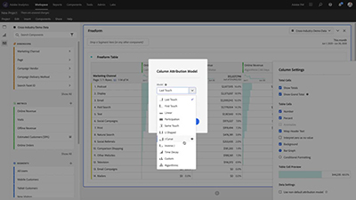

# Analytics チュートリアル

最大限に活用する [!DNL Adobe Analytics].  これらのチュートリアルを使用して Analytics の機能を習得し、ビジネスにとってのメリットを享受できます。 このコンテンツは、管理者、データアナリスト、マーケター、開発者およびアーキテクトに適しています。

開始するには、Dynamic Tag Management アカウントで
* 詳しくは、 **新機能** 以下の節で、最新の更新および機能について説明します。
* **スタッフのおすすめ**&#x200B;ではお気に入りのコンテンツをいくつか紹介します。
* **左側のナビゲーション**&#x200B;でトピックとサブトピック別のコンテンツをご覧ください。
* 以下を使用： **検索** フィールド（学習したい情報がわかっている場合）

役割別およびスキルレベル別のキュレーションされた学習体験も、コースセクションで提供されています。 Adobe IDでサインインし、に移動します。 **学習/推奨コース** 」をクリックします。

## 最新情報

* **[Adobe Analyticsモバイルスコアカードビルダー（ビデオ）](additional-tools/analytics-dashboards/adobe-analytics-dashboards-scorecard-builder.md)**
   *で作成したモバイルスコアカードを作成および共有する方法について説明します。 [!DNL Analysis Workspace] エグゼクティブユーザー向け*

* **[Adobe Analytics mobile scorecard アプリ](additional-tools/analytics-dashboards/adobe-analytics-dashboards-in-app-experience.md)**
   *モバイルスコアカードアプリケーションをダウンロードし、 [!DNL Analysis Workspace].*

* **[ワークスペース内の注釈（ビデオ）](analysis-workspace/navigating-workspace-projects/annotations-in-analysis-workspace.md)**
   *の注釈を使用すると、組織全体のユーザーに対して、コンテキストデータのニュアンスやインサイトを効果的に伝えることができます。[!DNL Analysis Workspace]既知のデータの問題、祝日、キャンペーンの起動などを使用して日付や日付範囲に注釈を付け、折れ線グラフ、テーブルなどに表示される内容がなぜユーザーに表示されるかを知らせます。*

## スタッフのおすすめ

<table>
<tr>
  <td>
    
    

      <a href="analysis-workspace/attribution-iq/algorithmic-model-in-attribution-iq.md">
    <strong>Attribution IQ のアルゴリズムモデル</strong>
    </a>
    

    

    <em>Analysis Workspace のアルゴリズムアトリビューションモデルでは、統計的手法を使用して、選択した指標に対するクレジットの最適な配分を動的に決定します。</em>
    

  </td>
   <td>
    
    

      <a href="analysis-workspace/navigating-workspace-projects/training-tutorial-template-in-analysis-workspace.md">
    <strong>Analysis Workspace のトレーニングチュートリアルテンプレート</strong>
    </a>
    

    

    <em>Analysis Workspace トレーニングチュートリアルでは、Workspace で初めて分析を作成するための一般的な用語と手順を順を追って説明します。</em>
    

  </td>
  <td>
    
    

      <a href="analysis-workspace/analysis-workspace-basics/analysis-workspace-overview.md">
    <strong>Analysis Workspace の概要</strong>
    </a>
    

    

    <em>Analysis Workspace の概要</em>
    

  </td>
</tr>
</table>

## その他のリソース

[Adobe Analytics ドキュメント](https://experienceleague.adobe.com/docs/analytics.html?lang=ja)