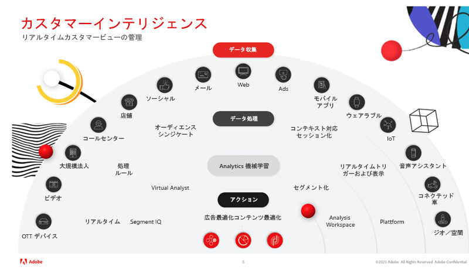
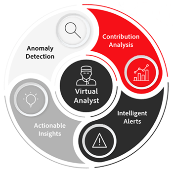

# Adobe Analyticsの Virtual Analyst と Segment IQ を使用して顧客インテリジェンスを習得する

この記事では、人工知能と機械学習 (AI/ML) を使用することの重要性を学びます。 次に、Virtual Analyst と Segment IQ を使用して、異常値の検出、異常値の回避、ROI の最大化を行い、グローバルなお客様から得られるメリットと実際の成功事例を確認します。

## 人工知能の価値

おそらく、チェスチャンピオンのガリー・カスパロフがIBM®の優勝者に敗れたことを思い出すでしょう [!DNL Deep Blue]. 専門家は、チェスのように複雑なゲームでは、マシンが人間の意思決定と判断を勝ち取ることは不可能だと確信していました。 しかし、人工知能の力が出土したので、これがビジネス戦略や技術革新の根本的な転換の鍵となった。

Adobe Analyticsは、エクスペリエンスビジネスのインテリジェンスの中核システムで、企業内の誰でも、あらゆるタッチポイントにわたってリアルタイムかつ大規模に、顧客のブランドとのインタラクションを把握し、最適化できます。

Adobeの AI ツールは、お客様の代わりとなるものではなく、お客様の取り組みに対する ROI を最大限に高めるためのものです。

## 分析を変換

分析を発展させるには、次の 3 つの主要な考慮事項に焦点を当てる必要があります。

1. 組織 — 顧客の全体像を作成し、インサイト主導型の決定を優先し、データを民主化する方法。

1. テクノロジー — データとテクノロジーがパーソナライゼーションを大規模に実現する方法

1. 顧客 — 信頼を構築し、変更に適応する方法。

Analytics は困難で時間のかかる作業ですが、常に、インサイトを得るまでの時間を短縮する必要があります。 組織が直面する主な問題は次のとおりです。

* 組織のリソースが限られている — 様々なビジネス目標によってリソースの可用性が制限される
* 限られた技術的専門知識 — 知識を共有し、データを民主化できる
* 顧客の期待 — チームが顧客行動の変化に動的に反応するか

## Adobe Senseiを活用した Virtual Assistant によるマスターカスタマーインテリジェンス

### 3 レベルの顧客インテリジェンス

顧客インテリジェンス戦略を成功に導くには、次の 3 つのレベルを経る必要があります（上の図 1 を参照）。(a) データ収集、(b) データ処理、(c) 分析、機械学習に至るまで、最終的に行動を起こし、コンテンツと広告を最適化する前に。

1. データ収集は組織に応じて異なり、様々なチャネルやメディアが含まれる場合があります。 これには、OTT デバイス、ビデオ、企業、コールセンター、店舗、ソーシャルメール、Web、広告、モバイルアプリ、ウェアラブル、IoT、音声アシスタント、接続カード、地域/空間などが含まれます。

1. データ処理には、リアルタイムデータ収集、処理ルール、オーディエンスシンジケーション、コンテキスト対応トリガー、リアルタイムセッションとビュー、プラットフォームが含まれます。

1. Analytics と機械学習には、Segment IQ、Virtual Analyst、Segmentation、Analysis Workspaceが含まれます

### Virtual Analyst を活用

例えば、 [Virtual Analyst](https://experienceleague.adobe.com/docs/analytics/analyze/analysis-workspace/virtual-analyst/overview.html?lang=en) ロックスターのアナリストとして、

* オフィスを離れる必要がなく、
* 誰、何、いつ、どこで、なぜ、そして何をビジネスに使用するかを指示
* すべてのデータにわたる異常値監視24/7、インテリジェントアラートで即座に機能
* コンポーネントをマスターできる [!UICONTROL Analysis Workspace]

### 隠されたオポチュニティの発見

* マーケティング KPI のステータスを常に把握
* マーケティング投資を確実かつ予測可能に行う
* 顧客の期待に応え、顧客の期待に応える/超える

### 実際の成功

仮想アナリストは、実際のAdobeのお客様に関する次のシナリオを明らかにしました。

* キャンペーンの終了 — 1.7 m 日当たりの売上高増加（主に早めに終了したキャンペーンが原因）。
* ベンダーのバグ — 特定の製品を買い物かごから自動的に削除していたタグマネージャーのバグが原因で、買い物かごからの削除が 73%増加しました。
* ブラウザーの問題 — Chrome ブラウザーに関連して、買い物かごの放棄が 8%増加しました。 この修正により、1 日あたり 1.200 万ドルの売上高増加が発生しました。
* クーポン不正 — 不正なトイレタリークーポンを促進する 2 つの主要な日次の取引/クーポンサイトによって参照されたトラフィックに起因する注文の 81%のスパイクを特定しました。 これらの注文はキャンセルできました。
* 企業スパイ — 主な競合相手がサイトからコンテンツを削り出して再利用するために作成したボット/クローラーによる訪問回数が 200%増加。 これらの IP はブロックできました。

## Adobe Analytics機能

[異常値検出](https://experienceleague.adobe.com/docs/analytics/analyze/analysis-workspace/virtual-analyst/anomaly-detection/anomaly-detection.html?lang=en):

* 組み込みの予測アルゴリズムを使用して、存在したことのないデータのスパイクや下降を識別します。
* 28 の独自のアルゴリズムを使用して、季節性、成長、循環モデルなどの異常値を識別し、休日の整合性を識別します。
* データサイエンティストへの依存を減らし、市民データサイエンティストの機能を活用します。

[貢献度分析](https://experienceleague.adobe.com/docs/analytics/analyze/analysis-workspace/virtual-analyst/contribution-analysis/ca-tokens.html?lang=en):

* データに大きな変化をもたらした貢献要因を迅速に特定する。
* 指標の変更に対する説明を検索する際に、数え切れない時間を節約できます。
* アナリストやマーケターをデータサイエンティストに変換するように設計された強力な機械学習を活用します。

[インテリジェントアラート](https://experienceleague.adobe.com/docs/analytics/analyze/analysis-workspace/virtual-analyst/intelligent-alerts/intellligent-alerts.html?lang=en):

オフィスにいるか、移動中であるかに関わらず、常にデータ内の異常を知らせます。

* Analysis Workspaceから直接アラートを作成
* 異常値 (90%、95%、99%)、変化率、超過/未満に関するベースルール
* 用途 [!UICONTROL アラートプレビュー] アラートがトリガーされた頻度を確認するには
* 自動生成へのリンクを含む SMS と E メールのサポートを活用 [Analysis Workspace](https://experienceleague.adobe.com/docs/analytics/analyze/analysis-workspace/home.html?lang=en) プロジェクト

[Segment IQ](https://experienceleague.adobe.com/docs/analytics/analyze/analysis-workspace/segment-iq.html?lang=en):

* セグメント間の違いと重複を見つけ、セグメント化戦略を示します
* KPI を推進するオーディエンスセグメントの主な特徴を明らかにする
* ディメンション、指標および他のセグメント間の共通性を表示する、数秒～数分以内のレポートおよびビジュアライゼーションの取得
* 価値の高い顧客とのエンゲージメントを向上

## Segment IQ による実際の成功

**モバイルとデスクトップ：** 「サイト間でヒット数を比較したところ、すぐに多くのタグの不整合が見つかりました。」 →製品リリース前のデータの問題の回避

**機能の使用：** 「当社の製品比較機能を使用したお客様は、コンバージョン率が 10%高くなりました。 これをページの上部に移動すると、注文が増えました。」 →コンバージョンの 4%の増加

**コンテンツエンゲージメント：** 「ニュースセクションの訪問者はビデオ広告を視聴する確率が 2 倍であることがわかりました。そのため、そのセクションにビデオオプションを追加しました。」 →視聴したビデオ広告の 7%の増加

**有料検索：** 「検索エンジンから来た訪問者は、アップセルの確率が 3 倍でした。 その結果、特定のキーワードの予算を増やしました」。 → 56%のアップセルリフト

**製品の在庫切れ：** 「Fitbit を購入するお客様は、在庫切れになる確率が他の全員の 6 倍でした。そのため、すぐに追加の Fitbit を注文しました。」 →在庫切れが生じ、年末商戦の注文が増えた

詳細については、 [ウェビナー](https://adobecustomersuccess.adobeconnect.com/pmetho6ivh68/).

戦略と思考のリーダーシップに関する詳細は、 [顧客の成功](https://experienceleague.corp.adobe.com/docs/customer-success/customer-success/overview.html) ハブ。
